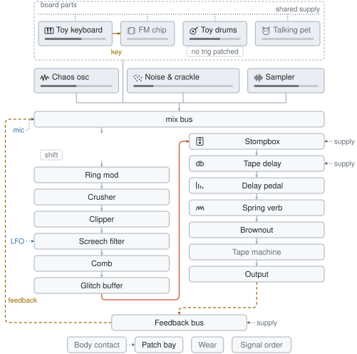

# bender

A virtual toy keyboard and drum machine run on a modelled supply rail; you
starve the rail, solder a pot onto the die, patch a microphone into the circuit,
and listen to what falls out. Nothing here plays a "glitch sample" — the
reboots, pitch dives and screams emerge from the mechanisms.

Real-time in the browser, on one AudioWorklet.

Live: https://cmdcolin.github.io/bender/

## The signal path

<picture>
  <source media="(prefers-color-scheme: dark)" srcset="img/chain-dark.svg">
  
</picture>

The app draws that from the chain itself — `pnpm diagram` regenerates it with
the same layout the panel uses (`src/ui/chain-map.ts`), which places the boxes
and routes the wires directly rather than handing the job to a graph library.
The panel redraws it live as you play: the bend slots appear in whatever order
you patched them, dead stages grey out, the feedback wire lands on whichever
node **Patched into** picks, and patch-bay wires ride over the top, dotted, from
what they pick up onto what they push. Click a node to open its controls; click
a wire for the bay, or its label for whatever that end is clipped onto.

Six slots, seven bends — you pick which ones are on the board. The drawing
reports which stages it found a door for, and the parts left over sit on a shelf
under it — the slot rack, the bends off the board, a bay or contact pad with
nothing wired to it — so every control is one click from the map, on the path or
on the shelf.

A stage opens as one list of controls, which is the right shape for a stage
until it has twenty of them. The three big ones carry headings you press
instead. The FM chip opens on the knobs you play it with and folds the patch
table and the bus bends away; the keyboard keeps its ROM, its clock and the pot
on the die out, with the supply underneath it and the knife on its bus behind
headings; the kit shows the grid and the five knobs that shape a hit, and folds
its converter, its trigger tricks and its own bus. A heading says how many
controls are down there — or how many of those you have moved, in which case it
opens with the panel, since a fold that hid something you set would be a panel
lying about the board.

Rows arrive as they get something to act on. A fault picks what happened to a
wire, so it waits for a wire to be cut; cut depth waits until one of them is cut
rather than grounded; the bend pot waits for a spot to be soldered to. A control
you moved and then unwired stays on screen, because a value you set is yours.
And a pick with more than six choices folds into a list — sixteen decay rates
make a paragraph of buttons, while the four things a knife does to a trace still
read as a row, so they stay one.

The sources sit at the head of the path as boxes of their own, because what
feeds what is the thing worth drawing. A dashed frame holds the three that are
one piece of hardware: the toy keyboard, the drum machine and the FM chip are
three dies sharing one supply, drawn as a dotted bar across the top of the frame
— so **Starve**, a knob on the keyboard's panel, dives the FM chip's pitch and
drags the kit's tempo with it.

Inside the frame the two machines you play sit side by side at one width, and
the FM chip hangs under the keyboard, set in from its edge, on the end of the
key line. That is the shape of the thing: the chip has no keyboard and no
sequencer of its own, and its key input is soldered onto the toy's gate line, so
it plays whatever strikes a note up there. A trigger bridge you patch yourself
runs across the lane between them, dashed and in the patch colour, so solder and
cable never look alike — and the chip drops far enough to stay clear of however
many you have patched.

Under the frame are the three that start where they stand — chaos oscillator,
noise and the sampler — and both bands drop onto one bar into the mix. The mic
is on neither: it is a wire, drawn onto whichever of the seven places **Mic
patch** solders it to, which is the mix bus on one setting and the middle of
something else on the other six.

Each box carries a glyph of the machine it is — a keyboard, a chip, a drum, a
scribbled wave, a speckle, a waveform — so the band reads as six different
machines before any of the names do. Under the name is a meter reading how far
that source's own fader is up, and on the two with a run switch, glyph and meter
both light while they play: the map saying that what you are hearing starts
here.

That meter is the fader, though, and how far a fader is up is a different
question from whether anything is coming out of the machine under it. So the
**mix bus** — the box both bands drop onto, and for a long time the one thing on
the map that opened nothing — opens like any other stage, onto the desk. Every
source's fader on one screen, under the name of its machine rather than the word
_Level_ that six of them carry; a meter along the foot of each row reading what
that channel is actually putting on the bus, drawn off the audio thread's own
taps rather than off the knob; and the bus's own meter under the lot, read where
the faders meet rather than at the output, so it says which channel is eating
the headroom rather than what the limiter did about it.

Which is how you find out that the FM chip has been sitting at three quarters
and silent, because nothing over on the toy was striking a note for it to play.
A fader lies in three ways — the chip nothing has struck, the sampler with no
file in it, the channel behind a bend that has stopped passing — and all three
of them read as a fader three quarters up. **Bus drive** is the desk's own knob:
the summing amp the six of them meet in, a wire at unity and the one saturation
ahead of the bends anywhere off it, with the feedback return landing on the same
bus, so a howl saturates in the amp it is coming back through.

The whole chain runs inside a single worklet `process()`, so the global feedback
loop is tight enough to squeal and every feedback path saturates in-loop —
runaway is a feature, held at the rails by design. A fixed safety tail (DC
block, soft clip, −1 dBFS limiter, NaN watchdog) means no setting can blow up
the output.

The keyboard plays four notes at once, the way the toys of the era did. Every
voice shares the one supply but has its own output stage, so a starving chip
doesn't sag in lockstep: each voice detunes and browns out at its own rail
voltage and a chord collapses raggedly, a note at a time. All four mix into a
single small output stage, so a chord leans on its headroom rather than coming
out four times louder — and draws harder on the rail, which is its own way of
browning the chip out.

The board draws three octaves from C3, and the sixteen keys your typing hand
covers carry their letter printed on them the way the toys printed note names.
Drag across it and it plays what you cross. <kbd>z</kbd> and <kbd>x</kbd> move
the whole board two octaves either way — a bass line at one end, well under the
toy's own bottom key, and at the other the top of the counter where the narrow
tones run out of ticks and widen back into squares.

**Hold** latches every key you touch after it; alt-click pins down one key on
its own, which is how a drone stays under both hands while the rest of the board
plays normally. Either way a second press on a lit key lets it go. A key nobody
lifted — the window losing focus mid-press, a window manager claiming the
alt-drag to move itself, a controller unplugged mid-note — is let go of rather
than left ringing, since the chip's voices latch and a note nothing ends never
ends.

The keys light for whatever is playing them. A hand lights them in the accent
colour — the pointer, the letter keys, a controller on the wire — and the toy
playing itself lights them amber: the ROM's tune walking up the board, the
oom-pah under it, a note the kit strikes through the trigger patch. The chip
reports what it is sounding along with the meter, so what lights is what is
making a noise rather than what was asked for: a voice decays out of the light
as it decays out of the mix, and a chip that browns out goes dark. Notes played
past either end of the drawn three octaves put a mark at that end, which is what
the octave switch is for.

**Tone** taps the divider chain at a different pulse width — 1/2, 1/4, 1/8,
1/16. Narrow taps null different harmonics and thin out; nothing levels them
back up, exactly as the chips left it. A counter can't strike a pulse narrower
than one clock tick, so the narrow tones widen back toward a square as the note
climbs past the divider's resolution.

**Auto bass-chord** is the accompaniment section, the thing that made a toy
keyboard sound like a whole bad band. It runs off the melody's own step clock —
bass on the step, chord stab on the offbeat, the bass alternating root and fifth
— and it reads its chord off the tune rather than a chord button: a chord tone
moves it, a passing tone leaves it where it stands. Each ROM declares its key,
so the three chords it has (tonic, dominant, subdominant) land in the song. It
runs on the same divider and the same rail as everything else, so the clock bend
drags it, the counter bend scrambles it, and starving the chip takes the backing
band down with the tune.

The drum machine is a sixteen-step plugboard rather than a fixed pattern. Six
voices — kick, snare, hat, clap, tom, cowbell — each get a row of steps you
click, and an accent row underneath decides which columns hit harder. The ten
factory patterns sit as buttons above the grid — rock, disco, breaks, electro,
motorik, one drop, bossa, fill, clap, march — and write into those same steps,
so a ROM is somewhere to start from rather than a mode to be stuck in. **Swing**
holds every offbeat step back and takes the time off the step after, so the
shuffle costs nothing in tempo. **Tune** and **Decay** move the whole kit at
once, and **Bit depth** is the word length of the one cheap DAC all six voices
share — wind it down and the tails fall off the bottom before the hits do.
**Ladder** is how far out that converter's resistors are. A ladder halves its
weight at every rung down the word, and this one got its rungs off a reel nobody
measured, so the steps come out uneven — unevenly, because the error scales with
the rung it sits on and half the tolerance of the top resistor is an enormous
number of counts. Which is why a cheap converter is not hiss: it is one lurch,
at the code where every bit changes at once, and for a signal that code is the
zero crossing. So it lands hardest on whatever is quietest, and a tail on its
way out is nothing but zero crossings. Winding Bit depth back up is no escape
either — quantization error halves at every rung, and the ladder's error is its
resistors' tolerance, so a longer word buys a longer word's worth of the same
grit. The accumulator those codes land in is as wide as the word and no wider,
and **Overflow** decides what a cheap one does when the sum will not fit: roll
over, and a step stacking four voices under an accent comes out inside-out while
the quiet steps either side of it are untouched, which makes the fold the
pattern's own dynamics rather than a setting. A kit that wraps also cannot leave
the box past full scale; one that doesn't leaves that to the limiter at the end
of the chain. The kit runs on the same rail and the same divider as the
keyboard, so starving the toy takes the drums with it and flat batteries drag
the tempo down with the tune. One oscillator clocks all of it and the envelopes
are counted off that same oscillator, so a kit going down with the cells goes
low, late _and_ long: the tails stretch as the pattern slows, and the nine
milliseconds between the clap's three bursts stretch with them until the clap is
a flam.

Each row also has its own length. Shift-click a step to bring that row round
after it — the badge on the right says where it ends, and pressing the badge
gives the row all sixteen back. Five on the hat against sixteen on the kick is
polymeter: the two line back up every eighty steps, so the pattern takes the
best part of a minute to repeat and never sounds like it is looping. The rows
share one clock, so nothing drifts out of time; what drifts is which steps land
together.

Drawing a run of steps is a drag rather than sixteen presses: press a step and
pull across the grid, and every cell the pointer crosses goes the way the first
one went — off a dark step it writes, off a lit one it wipes. The whole drag is
one entry in the undo walk, however many steps it turned over.

Beside the factory patterns is a row of verbs that rewrite whatever is on the
grid, none of which touches the tempo or the tone you dialled. **Roll** writes a
pattern nobody has heard: a feel picked at random — four on the floor, a
backbeat, a break, halftime, or hits spread as evenly as whole steps allow the
Euclidean way — with its trimmings, and a fill often enough that you hear the
bar end. **Vary** keeps the bar you wrote and does two or three small things to
it: a hit a step to one side, a ghost between the beats, one hit gone, an accent
somewhere else. **Turnaround** drops a fill over the end of the bar — a tom
roll, a snare roll, the first beat stuttered, claps trading with the snare, or a
hole with one hit at the bottom of it — and leaves what comes before it exactly
as it was. **Shift** turns every row one step later, each within its own length,
so a pattern you like lands somewhere else against the beat; shift-click turns
it back. **Half** and **double** stretch the bar over twice the time or squeeze
it into half of itself and say it twice. Every one of them is a single entry in
the walk, so the bar you had is one ctrl+z away.

A row's name is the voice: press it to hear that drum without waiting for the
playhead to reach the step you have just written. Every hit lights the name it
struck, whichever hand or wire struck it — the pattern's own steps, a pad on a
controller, a shout into the mic soldered to the trigger line, a bridged trigger
patch, the retrigger bend — and all but the first of those land on steps the
playhead gives no warning of.

**Tap in** is the other way a pattern gets written: arm it, and every pad hit or
press of a row's name writes the step it lands on, rounded to the nearest, with
each row taking its own column so a five-step hat lands where the hat actually
is. It needs the kit running for there to be a step to land on — armed with the
kit stopped, the button goes to an outline, because the hits still sound and
nothing else would say the pattern isn't being kept. It is never on when you
arrive, and every hit is one step in the undo walk — a hand that has just played
the wrong drum wants that hit back and nothing else.

### Cut the pattern bus

The wires between the step counter and the pattern memory take the same four
faults as the toy's ROM bus and the FM chip's register file, and the kit is the
one machine here whose memory holds something you wrote. Nothing malfunctions
when one of them goes: the counter counts, the memory answers, and the cell that
answers is the one the wires named rather than the one the counter did.

**Address line** picks which of the four the knife found. A0 held low files
every odd step on top of the even one below it, so the bar plays at half its
resolution twice over; A3 held high hands you the back half and never the front.
A row's length lives in the counter rather than in the memory, so an address
that has been leaned on reaches cells a five-step row could never have played.
The playhead on the grid goes on chasing the step it always did — the counter is
the undamaged part, and what it drives is the display.

**Data line** is the other side, and it is the trigger line itself rather than
an amplifier, which is what separates it from the cross-patch. One wire a voice,
in the order of the rows: forced high, that voice fires on every step the
machine fetches, and it fires for real — the row lights, the trigger bus is
stamped, and the sampler, the FM chip and the keyboard all hear about a hit
nobody wrote. Forced low, it is a row you can see and cannot hear. Bridge a pair
and the two come out only where both rows agree, which thins a busy pattern to
what they have in common. The cross-patch lends an envelope; this strikes the
drum.

## The other chip

The board has a second synthesiser on it, and it is not a divider. Two operators
a voice, four voices, sine into sine — the FM chip out of a cheap keyboard from
a few years later, sharing this one's supply.

It has no keyboard and no sequencer of its own. Somebody soldered its key input
onto the toy's gate line, so it plays whatever strikes a note over there: the
demo song, your hands, a controller, or a drum hit that came back round the
trigger patch. **Struck by** clips the kit's own lines on beside that one, and
since a trigger line carries a strike and nothing else, the note is this chip's
to decide — one per voice, in the kit's row order, a pentatonic apart, which is
what turns a pattern written for drums into a riff. Four channels between them,
so a busy grid steals its own notes. Turn the toy itself down to nothing and the
ROM keeps clocking, because the tune is now the other chip's part. It runs off
the same rail too, so starving the toy dives its pitch, drags its envelopes out
and browns it out along with everything else.

**Voice** picks one of eight patches, **Brightness** is how loud the modulator
is into the carrier — the whole of the tone control on a two-operator part — and
**Feedback** is how much of the modulator goes back into itself. Past about five
it stops making harmonics and starts making noise, which is where these chips'
drum sounds came from.

A gate line carries a level, not only an edge, and the driver on this chip reads
both. Under your own hands the note is held: the key is still down, so the
processor waits and writes the key back up when you let go — which is why the FM
chip holds a chord the way the toy does, however long you sit on it. Everything
else arriving on that wire is an edge and nothing more — the demo song, a drum
hit through the trigger patch, a kit line clipped on at **Struck by** — and an
edge says nothing about when to stop, so **Note length** is where that gets
decided. What a held note actually does is still the patch's business: four of
the eight wait for the key, and the struck four — e.piano, bell, bass, marimba —
decay on their own whatever your finger is doing.

Three more, under _inside the patch_, open the patch up rather than picking one.
**Mod ratio** and **Car ratio** are what each operator runs at against the note,
off the part's own multiplier table — the modulator's ratio picks which
harmonics it can put there, the carrier's moves the note, and the interval
between the two is the whole character of a two-operator sound. **Mod decay** is
how fast the modulator falls away, which is the difference between a struck
thing and a blown one: a bright attack collapsing to a sine in eighty
milliseconds is a bell, and one that never collapses is an organ. All three are
four bits each, because that is what the registers hold — the table stops being
a scale near the top and repeats, there is no detune anywhere on the chip, and
every one of them rides out in the same eight bytes as the rest of the patch.
Which makes them three more knobs whose whole job is to hand a cut wire a fresh
write to ruin.

### Cut the dataline

Which is what the chip is here for. Nothing about this synthesiser is _played_ —
it is configured, one byte at a time, by a processor that works out what the
sound should be and then tells it. Every note is a handful of writes: the patch,
the frequency, the key going down, and later the key coming up. Put a knife
through the wires carrying those writes and the chip does not malfunction. It
receives a byte with one bit wrong and executes it perfectly.

And then it goes on executing it, because a register holds what it was last told
until something tells it otherwise. That is the part nothing else on this board
does. A starved rail is a sound that lasts as long as your hand is on the knob;
a byte that landed wrong is a sound that lasts until the processor happens to
write that register again — which might be the next note, or might be never.
Take the knife off the bus and the damage stays: the patch registers are only
rewritten when a knob it knows about moves, so the voice you are hearing is
still the one the cut wires let through. Wind **Brightness** a hair and you are
asking it for a fresh set of eight bytes, which is a fresh chance for the fault
to land.

The famous one is the key going up. A note ends because the processor writes one
bit of one register back down and the chip sees it change — and a wire that
cannot change is a wire the chip never sees change. Hold that line high and the
note does not glitch or stutter; it simply never ends, and the notes after it
arrive as changes of pitch under an envelope that never restarted. Hold it low
instead and the key never goes down at all: a keyboard that plays nothing, which
is the other thing that happens to these when you get it wrong.

The rest of the map is worth knowing because it decides what one wire is worth.
The nine bits of frequency do not fit on eight data lines, so the top one shares
a byte with the key going down — cut up there and the pitch and whether the note
happens at all move together. Volume goes out with the note as its own nibble,
so a wire stuck in it leaves one of the four channels at the wrong level for
good. **Address line** is the other bus: the byte arrives intact and gets filed
under the wrong register, which is the more violent of the two, because whatever
should have gone there never did.

### Slip the strobe

Both bends above work by bending a wire, and both are a byte that comes out
wrong somewhere. **Strobe slip** is the third one, and it corrupts nothing at
all. A register write is two things arriving together: a number naming the
register, and the value to put in it. What pairs them is the strobe — the pulse
that tells the address latch to take what is on the wires right now. Make that
pulse marginal and the latch sometimes does not catch it, and the value commits
to whichever register the last pulse that did land had named.

Nothing is broken in that sentence. Both bytes crossed the bus intact, both are
exactly what the processor spelled, and the register they landed in is a real
register. They are simply paired one write late, which is a sound no cut wire
can make, because a cut wire has to damage something to do anything.

A latch that misses holds rather than skips, so the slip compounds. Two misses
running is two writes of lag; wind it all the way over and the latch never moves
off the first register it ever caught, every write in the run piles into that
one, and the chip goes silent because nothing ever names the register carrying
the key. The interesting playing is well below that, where most writes land and
some arrive one late.

What it costs you is however many writes you make, which is why this is the bend
the effect ROM was worth building for. A note is four writes and comes out
smeared. The weather is hundreds a second, and the processor spends them
rewriting the same short run of registers over and over — the frequency count,
then the byte carrying the key. Shift that by one and every frequency byte you
send lands in the register holding the key down, continuously, for as long as
the script runs. The crickets are the clearest: clean they are chirps with gaps,
and a slipping strobe drones them into one tone. Which is exactly where a cut
key line takes them, arrived at from the opposite direction — every wire on the
board working perfectly, and the key-up landing next door.

### Cut the wave ROM

Every bend above is a bend on the write path, and they all work the same way in
the end: a byte lands wrong in a register and stays there. There is a second bus
on this chip, and the processor never touches it.

Nothing here computes a sine. The part looks one up — a quarter of a wave in a
table, 256 entries, with two more bits of phase to build the other three
quarters out of it: one mirrors the quarter back on itself, one flips the sign.
So the waveform is an _address_, ten wires wide, read eight times a sample by
the operators themselves. **Wave line** is a knife through one of them.

It is the opposite bend to the data lines in every respect that matters. Nothing
accumulates, because nothing is being told anything — take the knife off and the
next sample is clean. Nothing waits for the processor to come round either: it
is under your hand for as long as the note is held. And the wires are weighted,
so where you cut is the whole of it. Hold the mirror line and the quarter simply
runs twice instead of turning round, which is a sawtooth edge and an octave
where a sine was — on the modulator, an entirely different set of sidebands
rather than a damaged one. Hold the sign line and every read comes back off the
top half of the table: a rectified wave, all octave and no fundamental. Cut low
enough down the bus and you have severed a wire worth a fraction of a phase
step, and you will hear almost nothing, which is what a binary bus is.

Cut is the strange fault here. A severed trace is a pin nothing drives again, so
it holds the last phase bit that reached it and stops being part of the wave at
all. Back **Cut depth** off and the trace still conducts sometimes, so the bit
is right on some reads and stale on others, and the wave flickers between two
shapes at the rate the operators come round rather than at any rate anything is
playing.

### The register the driver only clears

There is one more register on the part, sitting in the gap above the patch
bytes, and the datasheet does not have it. The factory used it to check the die.
No driver ever writes anything musical there — the only time one goes near it is
the write that clears it at power-on, because a chip that came up with a test
bit set would be a chip that never sounded right.

That one write is the whole of the bend, because it is a byte on the same eight
wires as every other. A **data line** held high sets a bit in it that nothing in
the chip's normal life ever sets, and the clear that should undo it crosses the
same broken wire. Move a knob and the processor sends the patch again, test
register first, and corrupts it again identically. What is in there does not
decay, drift or resolve; it is overwritten by another corrupted copy of itself
until you take the knife off the bus.

And what those bits switch is not in the register file's vocabulary at all. They
are the counters and the output latch themselves: every operator forced wide
open so the envelopes stop being envelopes and the keys become a gate; the
envelope counter forced to its fastest step, so every note in every patch
collapses to the same four-millisecond click; the output latch taking every
other slot, which is half the sample rate and all of the aliasing; and the
latch's sign line held, so what reaches the pin is rectified. No arrangement of
patch bytes makes any of those sounds, which is the point of reaching a register
that was never meant to be part of the instrument.

### The effect ROM

**Effect** is the other button on a keyboard like this, and what comes out of it
is not a sample. There is no sample memory on the board and nowhere to put one.
A bird call is a little program in the processor firing register writes at the
synthesiser hundreds of times a second — a stack of short frequency sweeps with
a key-on between them. Surf is the modulator's feedback wound past the point
where it stops making harmonics and starts making noise, with slow swells
written into the level register. Wind is that same noise under a random walk on
the frequency count. Then a siren, which is nothing but the frequency registers
being rewritten, and crickets, which are nothing but key-ons.

Which makes an effect the busiest thing the bus ever carries, and the dataline
bend scales with traffic. A note is four writes. A bird call never stops, so
every one of those writes arrives wrong and the corruption never lets up — and
the gesture survives it, because the timing belongs to the processor and nothing
here has been done to the processor. What you get is the shape of a bird call
driving a chip that has been told nonsense.

Two things fall out of that which no bent patch can do. Set the fault to **cut**
and the stale bit carries the previous write's value forward, so on a sweep each
write is contaminated by the one before it: the corruption is correlated with
the effect's own motion rather than sitting at a constant offset, which is the
difference between a recording that sounds alive and one that sounds merely
broken. And a sweep rewrites the frequency registers constantly while never
rewriting the patch, so the pitch keeps recovering and the timbre stays scarred.
You hear the two timescales at once, which is the register file's persistence
doing something audible.

An effect borrows the fourth channel and the whole patch to do it, because there
is one instrument in the register file and the effect wants it. So the keyboard
is down to three voices while a script runs, playing in the effect's voice
rather than the one under the voice button — until you let the button go, when
the processor sends the voice again, over the same wires, for the fault to catch
one more time.

Starve the rail underneath and the two clocks come apart. The processor is
clocked off a resonator and a resonator does not care what the supply is doing,
so the calls go on arriving at the rate it sends them while the synthesiser they
are addressed to dives and slurs — the one place on this board where a gesture
and the pitch of it are on different clocks.

## The trigger patch

The rail is what the two boxes share by accident. The trigger patch is what you
solder on purpose: their trigger lines, brought out so either end can drive the
other.

**Kit fires keys** bridges one of the kit's voices — or any hit at all — onto
the keyboard's gate, and a drum hit strikes a note. It strikes a key voice
rather than the melody line, so it sounds with the demo song stopped, the same
as your hands do. What it plays is its own choice: the note already standing,
**the next step** of the ROM, any step at random, or a tone off the
accompaniment's triad. The next step is the one to try first — one hit, one
step, so the pattern clocks the tune and the kick decides where the melody goes.
The whole band walks with it — the bass and the chord stabs move on the step
whichever clock moved it. Write a bar with the kick on the beat and the toy
plays in time with itself for once; leave the demo song running underneath and
both clocks push the same counter, which is a tune skipping ahead of itself.

**Keys fire kit** is the wire back: every note the chip strikes fires a drum
voice, whether the pattern is running or not, so the kit is playable by hand off
the keyboard. **The step** hands the grid over instead — a key fires whichever
column the sequencer is sitting on, and an empty column falls back to the kick
the way the retrigger bend and the mic trigger do.

Solder both and the two boxes play each other. The lap closes once a block
rather than once a sample, because the chip is wired ahead of the kit and reads
the kit's hits 2.7 ms late, so what comes out is a rattle at the block rate held
at the rails by the safety tail — which is what a trigger line looped back on
itself has always done.

Both lines are patch-bay sources too, so a hit can push a cutoff, a tape speed
or the glitch chance. Unlike the LFO they don't sweep: they snap up on the hit
and fall from there.

The bends that matter:

- **Starve** sags the shared toy supply: pitch dives, notes collapse, and past
  the brownout threshold the watchdog reboots the chip — the tune keeps
  restarting. There is one RC oscillator in a toy like this, and everything is
  that oscillator divided: the note, the sequencer, the envelopes. So they
  cannot come apart. A sag that lasts drops the tempo by whatever it drops the
  pitch, and the tune slurs and slows together the way a tape does. What can
  differ is only how fast each end sees the rail move — the timing pin has its
  own decoupling, so a dip inside a single note is averaged away before it gets
  there, which is why a chord sags the pitch without making the beat stumble.
  The pot doing the starving is a resistor to ground, so it goes on drawing
  after the chip has gone quiet; a quarter of the way up is a toy running flat
  and diving, and three quarters restarts the tune several times a second. Where
  the watchdog trips drifts with heat and wanders on its own, the reset line
  holds for somewhere between 40 and 130 ms, and the rail has climbed somewhere
  different by the time it lets go — so the reboots never land on a metronome.
  The lamp on the toy's deck, above the keys, is that rail in volts, 4.5 V on
  fresh cells, and it says **reboot** when the watchdog cycles the chip:
  everything else in this list is that number moving.
- **Reservoir** is how much of the board's own capacitance sits behind whatever
  Starve is pulling on, and it is the difference between a starve you land on
  and one you hear travel. Across the supply pins there is a tenth of a
  microfarad and the rail follows its load inside a millisecond, so the pitch
  arrives at its new place rather than going there. Wind this up and the same
  starve acquires a shape: the note leaves from where it was, dives,
  decelerating as the cap and the pot come into balance, and parks at the bottom
  — everything on the rail going with it, pitch, tempo and envelopes together.
  It moves no voltage at all, only the time taken to reach one, from 17 ms to
  two seconds. The travel is geometric because the caps on a real board are
  decades apart, so the swoop sits through the middle of the knob rather than
  crushed against one end. Far enough up and the watchdog stops snapping the
  rail back at all: the tune is struck high, dragged down, cut off, and struck
  high again.
- **Clip chatter** is the hand holding the paperclip. Nobody solders anything
  for this bend — bare metal dragged across the pads finds a point, chokes the
  supply hard for a few tens of milliseconds and lets go, and the rail leaves
  and comes back at whatever rate the Reservoir allows. A choke, not a short:
  crash the rail to ground and the pitch is simply gone and then simply back,
  two steps with the dive missing. The rate is an average and the fault cluster
  decides how much it bunches, because a hand does not keep time.
- **Clip on clock** is where that same piece of metal landed, and it is the
  difference between a sag and a dive. A CMOS oscillator barely cares what its
  supply is doing: starve the rail and you get two thirds of an octave, and then
  the chip stops running rather than going any lower. Hang a capacitor on the
  oscillator instead and you are dividing the clock, which has no such ceiling —
  four octaves at the top of the knob, with the whole timebase going along, so
  the tune, the tempo and the envelopes dive together and the melody arrives
  somewhere under the bottom of its own keyboard, all fundamental and no
  harmonics left. The travel is the found capacitor charging through the
  contact, so Reservoir sets how long the dive takes here too.

  It is one piece of metal in one place, so the knob is a trade rather than a
  second bend: a supply pad is a low impedance that draws current when you
  bridge it, the oscillator pin is the highest impedance on the board and draws
  essentially none, and the further the clip moves onto the clock the less of a
  choke it is. Leaving is slow and coming back is instant — charging that cap
  takes time, lifting the clip takes it out of the circuit altogether — which is
  the whole reason the bend reads as a dive rather than a warble.

  This is also why bare metal on a cheap board finds the sound at all. Almost
  every node on a toy keyboard is low impedance and shrugs off a bit of stray
  resistance; the timing pin is the one place where a paperclip, a fingertip or
  any stray RC rewrites the machine. It needs a toy clocked from a bare RC
  oscillator rather than a resonator — which is what the cheap ones used, to
  save the cost of the resonator.

- **Latch-up** is the brownout that doesn't reboot. CMOS on a collapsing rail
  can jam instead: the die holds whatever note was sounding, keeps drawing
  current, and the output stage sits where it was left rather than fading with
  the supply, so one note screams and dives for up to a second while the
  watchdog is locked out — until the current gives out and it finally gets its
  power cycle. Hot parts latch more readily, which is why it happens to a toy
  that has been running a while and not to one just switched on.
- **Crystal drift** is the toy's clock wandering off the ratio you set it to.
  Nothing pulls it back, so it never settles against the drum machine: the two
  lean past each other and come back for as long as you leave it running.
- **Junk in the counter.** Pressing play drops the needle on step 0; coming back
  from a brownout does not. The program counter holds whatever was in the latch
  when the rail went, so the tune comes back from the middle of itself as often
  as from the top — a starving chip that always restarted at bar one was a loop.
- **Batteries** is how flat the cells are, which is the floor Starve collapses
  from. Flat cells hold a lower open-circuit voltage and more internal
  resistance, so the rail never comes back to full between notes and every note
  sags it further with nothing starving it. The divider tracks the cells rather
  than the instantaneous dip, so the whole toy runs low _and_ late — tune,
  accompaniment and drum machine slowing together, and every envelope counted
  off that divider lengthening as it goes — where Starve's per-note dive comes
  out as pitch. Far enough down and a chord alone is enough to brown the chip
  out.
- **Lead resistance** is a resistor in series with the cells, which is the half
  of flat cells that is not the voltage. With nothing drawing, no current flows
  and a resistor carrying nothing drops nothing — so the rail rests exactly
  where the stock board rests, however far this is up. Play a note and it is in
  the way: the supply sags on the attack and climbs back between hits, as far as
  the Reservoir gives it time to travel. That is the difference worth having.
  Batteries is a toy running out, low before you touch it and lower after. This
  is a toy that whoops on every note and never runs out of voltage to whoop
  from, and it is what to reach for when what you want is the swoop rather than
  the decline.
- **Bend spot + pot** solders a virtual pot onto the die: clock feedback,
  program counter (melody scrambling), DAC bias, or the gate line.
- **Data line + Address line** put a knife through the two buses between the ROM
  and the rest of the chip. Every other bend here attacks the analogue — the
  supply, the clock, the output stage. A bus fault leaves all of that working
  perfectly and changes what the chip is being _told_: the divider still
  divides, the counter still counts, the envelope still falls, and the note that
  arrives is simply not the note the ROM holds. It is the same wrong note every
  time that step comes round, which is the whole difference worth having. The
  counter bend above wanders; a cut bus is a different song, in time, for as
  long as you leave it.

  The chip stores a note code rather than a pitch, so the data lines are
  intervals — D0 a semitone, D2 a major third, D5 the better part of three
  octaves. Codes 0 and 1 are the two things that are not notes, which is why a
  data line held high fills a song's rests in: a rest is only a code, and a code
  with a bit forced into it is a pitch. The address lines carry structure
  instead. A0 plays the tune in swapped pairs, A3 held low locks it into the
  bottom eight steps for good, and a line this ROM never drives does nothing at
  all — a sixteen-step song has no A4 for you to find, which is the honest
  answer rather than a special case anybody wrote.

  Four things happen to a wire. **To ground** and **to +V** nail that bit for
  every read. **Bridged** solders the line to its neighbour so the two can no
  longer disagree, and whichever driver pulls low wins — the melody comes out in
  clumps. **Cut** parts the trace and leaves the pin floating, and a CMOS input
  with nothing driving it keeps the charge the last word left on it: the bit
  goes stale rather than stuck, frozen on whatever the bus happened to be
  carrying at the moment the knife went through. **Cut depth** is how far
  through it went. All the way and the bit stays where it froze; back it off and
  the trace still carries some of the time, so the bit is right on some reads
  and a word old on others and the melody flickers between two versions of
  itself.

- **Retrigger** hammers the drum machine's trigger line; past ~40 Hz the
  retrigger period becomes the pitch and the kit screams.
- **Trigger floor** is how far a voice has to have drained before the one-shot
  behind it will answer that line again. At nothing every pulse strikes, which
  is the tone above. Wind it up and a line hammered faster than a voice can
  empty comes out divided — the kit answers a 300 Hz hammer with a rattle at a
  rate its own envelopes set, so Decay is what tunes it and a sagging supply
  slows it. All the way up, a voice will not strike again until it has stopped
  sounding. It sits on the trigger line rather than in the bend, so the
  sequencer, the pads, the mic and the keyboard queue behind it too.
- **Cross-patch** bridges two drum voices' envelope pins, so each amplifier
  hears the wrong envelope. Bleed it all the way over and the voices swap: the
  kick fires on snare steps, the noise swells over the kick's long decay, and a
  hat tick puts a pitch blip through the kick oscillator. Rotate passes the
  original three around a ring; whole kit passes all six, so a voice with no
  steps of its own still fires — the cowbell rings on a kick, the clap answers a
  tom.
- **Mic patch** wires the mic past the mixer, straight onto the chip rail, the
  oscillator's FM input, the delay feedback path, the ring mod carrier, or the
  trigger line of the drum machine or glitch buffer — clap at it and the circuit
  fires.
- **Struck by** puts a dropped file on a trigger line: one of the kit's voices,
  any hit at all, a note off the keyboard, or a shout in the mic. Set **Ending**
  to one-shot and whatever you dropped is a seventh drum voice, played from the
  top on every hit; left as a loop, the trigger is a needle dropped back at the
  start while it runs.
- **The patch bay** is four wires and a soldering iron. Each picks up the bay's
  LFO, the sag on whichever supply is dying, the output envelope, the mic, an
  axis of the body pad, the feedback bus itself, the chip's sequencer ramping
  across each ROM step — the one source that stays in time with the tune — or
  either box's trigger line — a drum hit or a note struck — or how hot the board
  has got, which is the slowest thing on it and the one that never comes back to
  where it started. That goes onto a filter cutoff, a carrier, a clock, the
  shift, the word length, the tape speed or delay time, the glitch chance, the
  stompbox drive, the kit's trimmer, the tank's decay, the drum cross-patch or
  the feedback amount. Depth goes negative, so a failing supply can drag a pitch
  either way.

  One destination is not a stage at all: **starve** is the supply the toy runs
  on, so a wire there reaches everything powered from it at once. Off a drum hit
  it browns the chip out on every kick and the watchdog restarts the tune from
  wherever the counter was; off the LFO it is a rail that dies in time.

  Any wire can also land on _another wire's depth_, which is where a pair stops
  being two modulations and starts being one neither of them wrote. And the
  bay's oscillator has two shapes past the four an LFO has: **chaos** folds
  along a Rössler band, passing near where it has been without ever landing
  there, and **drunk** is a bounded walk that reflects off the ends of its
  travel. Rate still says roughly how fast; nothing about the next cycle is in
  the last one, which is the difference between a modulated board and a board
  that keeps surprising you.

- **The body pad** is the bare contacts every bent toy grows sooner or later:
  touch both and your own resistance is the control. It does nothing until a
  wire in the bay is soldered to it, which is also true of the real thing.
- **Brake + supply drag** treat the tape capstan as a motor with weight.
  Everything already on the tape sags on the way down and spins back up on
  release; wire the motor to the supply and the repeats dive whenever the power
  fails.
- **Freq shifter** moves every partial by the same number of Hz rather than the
  same ratio, so harmonic input comes out inharmonic. Its own feedback makes
  each lap shift again — the barber pole — and parked inside the global loop it
  stops the squeal ever settling on a pitch.
- **Patched into** re-solders the feedback return: the source mix, the
  oscillator's FM input, the toy rail (the output browns out its own toy), or
  straight into the tape.
- **Ground hum** leaks mains fundamental and rectifier buzz in proportion to how
  hard the supply strains; the ripple wobbles the rail.
- **Sub octave** is a flip-flop divider under the clipper that mistracks on
  complex input, like the vintage pedals did.
- **The stompbox** is the dirt box at the front of the board, and each of its
  six circuits clips somewhere different in its own gain stage rather than
  running the same curve through a different formula. The screamer clips inside
  the op-amp's feedback loop, so the dry note walks under it and never quite
  lets go; the rat clips to ground behind an op-amp too slow to keep up, which
  is the fizz; the muff is two clipping stages and a scooped tone stack the note
  has to survive; the germanium one is lopsided, and its bias rides down on the
  signal so it splutters as a note dies and cleans up when you back off; the
  octave rectifies the shape before it clips it, so it comes out an octave up on
  one note and gargling on two; the gate is misbiased to the edge of cutoff.
  **Battery** is how dead the 9V is — the rail falls as the pedal works, so
  notes bloom and collapse, and it shares the board's supply, so Starve and
  Brownout drag the pedal down with everything else. Starve the gate circuit far
  enough and it stops needing an input at all.
- Every feedback (delay, comb, screech filter, feedback bus) goes past unity.

## Parts

Everything above is a thing you are doing to a toy. This rack is what the toy
is.

Each of these was a number compiled into the model — how hard a paperclip
chokes, where the reset chip gives up, how big the cap on the oscillator is, how
far apart the four output stages came out of the bin. They were fixed because
there was one board. A bent toy is a board whose parts are not the ones on the
schematic, so they are knobs, and every one of them rests on the number that was
compiled in: a board nobody has been at here renders the samples it always did,
which is what keeps every saved link and every preset meaning what it meant.

- **Timing pin** is the decoupling cap on the oscillator, as the time it
  averages the rail over. One RC oscillator clocks the whole chip, so pitch,
  tempo and envelopes cannot come apart; what this decides is which sags the
  timebase notices at all. At stock a single note's current is gone before the
  clock sees it, which is why a chord sags without the beat stumbling. Scrape
  the cap off and nothing is averaged — every note in a chord trips the tune.
  Wind it up and the timebase stops hearing the rail, so the pitch dives while
  the tempo holds, which no chip with one oscillator in it can do and is the
  sound of a board somebody has already been at.
- **Watchdog** is where the reset chip decides the supply has failed. It cannot
  go under the voltage the die stops running at — a watchdog watches for the
  chip failing, so the bottom of the knob is that point and not a millivolt
  lower. Sitting there, the reboot is the last thing that happens on the way
  down and you hear the whole dive first; up at the top the toy is reset while
  it is still perfectly able to run, and a sag it used to ride out is a toy that
  will not stay booted.
- **Latch hold** is where a jammed die and its supply come to rest against each
  other. A latch is a short the chip cannot let go of and it needs some rail
  left to hold itself in, which is why the note screams rather than stopping.
  Low is a growl under the floor; high is a shriek that nearly resolves.
- **Clip bite, dwell, charge and release** are the paperclip itself. Bite is how
  hard it chokes, dwell is how long a touch lasts on average, charge is the rate
  the clock leaves at while the metal is down, and release is the rate it comes
  back when the metal lifts. Stock, release is ten times charge, and that
  asymmetry is the whole reason the bend reads as a dive: pressing down has to
  charge a cap through the contact, lifting off just takes the cap out of the
  circuit. Bring release down onto charge and dives turn into a warble.
- **Clock drag** is how deep the cap on the timing pin can divide, in octaves.
  Starving the rail is worth a fraction of an octave before the chip stops
  running at all; dividing has no such limit. Four octaves is stock — enough to
  put the melody under the bottom of its own keyboard.
- **Part spread** is how far apart the four output stages came out of the bin.
  At zero the four are identical and a chord on a dying rail collapses in
  lockstep, cleanly, all at once. Wound up they scatter, and the chord comes
  apart over a second with the last voice still going.
- **Mixer drive** is the headroom in the one small output stage every key voice
  runs through. Low is a clean summing amp with room for all four; high squares
  off on two notes, so playing harder changes the timbre instead of the level.
- **Part grade** on the kit is what the reel those ladder resistors came off was
  sold as. Which rungs are long and which are short is soldered in; this is how
  far out they are.

The blind dice skip this rack. A roll asks for a different board, not a
different model of how a board works — the watchdog three hundred millivolts up
is a toy that reboots before any sag can start, and there would be no telling a
dud roll from a dud board. Point at the rack and ask for a roll and it rolls:
that is a hand, and a hand can tell the difference.

## Ageing

Every bend above is a thing you can hear inside a note. These five are about
what the board does over minutes, and they are the difference between an
instrument with settings and an instrument with a mood. All five sit at nothing
until asked, so a board that doesn't want them is the board that was here
before.

**Heat** has no reading on the panel because a real one doesn't either. It
climbs off whatever you are making the board dissipate — a screaming loop, a
starved rail, a pedal wound up — over about a minute, and falls back over two.
The rail holds less as it goes, the watchdog trips sooner, a starving oscillator
takes longer to come back after each stall, and the spring tank drifts flat.
Turned up, the board three minutes in is not the one that booted, and it never
settles anywhere, because where it goes depends on what you played on the way
there.

**Fault clustering** is whether faults arrive on a rate or in runs. Every
dropout, spark, glitch and counter slip used to roll its own dice at a constant
rate, which the ear averages into a texture inside a second — after that it
stops being an event and becomes the sound of the knob position. Wound up, each
fault leaves the next one likelier for a couple of seconds, the way a joint that
has started arcing goes on arcing. The knob redistributes rather than
intensifies: the same faults arrive as a minute of nothing and then a dozen at
once, because the resting rate is what pays for the bursts.

**Dry joints** is how intermittent the solder is under the bend slots. A cold
joint opens and the stage on that slot is simply not in the path — no dry/wet
fade, a click going out and another coming back, and whatever it was ringing
left where it stood. What drops out is whatever you patched there, so the board
rewrites its own signal path while it plays.

**Re-solder** is the board changing its own topology: two bend slots swap
places, or the feedback return jumps to a different pin. Nothing about the
settings moves — every bend keeps the values you gave it — which makes it the
one roll on the board that asks "what if this went through that first" while
your hands are off it.

**Cross-coupling** wires the loop's own brightness against its supply. Top end
in the chain opens the screech filter's resonance, which makes more top end; the
same energy strains the supply and draws on the toy's cells, which shuts it back
down several hundred milliseconds later. Two couplings of opposite sign on
different time constants never find a level to sit at, so a squeal hunts around
a pitch instead of settling on one — with no LFO anywhere near it. It is also
how a runaway browns out the toy that started it.

Sitting under all of it: the noise, the faults and the reboots are seeded off
the clock when the instrument boots. A board is still a board and does what it
says, but two takes of one board are two takes rather than the same file twice.

## The tape machine

The tape delay wobbles its echoes; the tape machine records the instrument. It
sits last, after the brownout, so everything upstream is the room and this is
what it went down on.

Signal crosses the record head through a pre-emphasis curve and comes back
through its inverse, so the highs saturate first and transients round off before
anything sounds distorted. Hiss lands on the medium rather than in the mix — the
replay head colours it, the speed sets how loud it is, and it breathes a little
with the signal, the way biased oxide does.

**Speed** moves the machine as one part rather than one knob among ten. The head
gap loses highs at a wavelength, so a slower tape loses them lower; the replay
bump sits at a wavelength too, so it drops with speed; less tape past the head
per second means more hiss and slower wow; and a spool wrap takes longer to come
back round, which sets how far behind the print-through ghost arrives. 3¾ ips is
dark, noisy and unsteady. 15 ips is nearly a wire.

**Bias** runs underbiased-bright-and-crunchy to overbiased-dull-and-squashed,
distortion and top end moving against each other. It carries its own record tilt
rather than leaning on the head gap alone — at 15 ips the gap already sits past
the programme, so a gap-only model inverts the knob at the fast speed.

**Hysteresis** is the half of tape a clipper cannot do. A symmetrical saturator
makes a third harmonic and a fifth and never a second, which is the sound of
something breaking up rather than of something warm. The medium is not
symmetrical: it arrives at the gap already magnetised, by more of it the harder
it has been driven, so the curve sits off centre and the two halves of a wave
saturate against different amounts of it. That difference is the second harmonic
— and because the offset rides the level rather than the note, it blooms up as
you play into the machine and lets go again when you back off. Under-bias leaves
more of the field behind, so bias and this multiply. It ships wound partway on,
because a tape machine that has to be asked to sound like tape is one nobody
asks.

**Head bump** is the other half: the lift where the wavelength going past the
replay head is the size of the head, which is the low end every machine adds
without being told to. Speed still decides where it sits — a wavelength is a
distance and a faster tape lays it out longer — and this is how much of it comes
back. Stock is the amount the machine was built with, so a board that never
touches it is the machine as it was.

The failures are the point. **Dropouts** shed highs before they shed level,
which is what separates oxide from a power cut. **Print-through** is the layer
wound underneath bleeding through, a dull ghost one wrap behind. **Azimuth**
lags the right channel and eats its top end, so the take collapses badly to
mono. Wow is capstan eccentricity plus a slow drift that never lets the pitch
settle; flutter is the fast wobble plus the scrape of tape dragging past the
head.

The dry side runs down the same nominal head delay as the wet, so **To tape**
only combs once the transport actually wobbles.

Presets morph into place; **random** rolls a preset and jitters it, **mutate**
shakes the current board. None of the three take what is yours: the demo song
you picked, the pattern you wrote and the output, mic and sample levels all stay
where you left them — no preset names the song at all, so auditioning a board is
a question about the circuit and never about the tune.

A shake lands on a handful of controls rather than on all of them. Nudging every
one of the hundred-odd at once is the central limit theorem with a slider rack
in front of it: each control moves by less than you can hear it move, none of
them moves far enough to be the reason the board changed, and what comes back
drifts toward the middle of every travel — which is the one place nothing sounds
like anything. Leaving most of them exactly where they were is what lets the few
that did move be audible as the difference. And a random look thins itself down
to three wet bends on the way out, by taking the extras off the board rather
than turning them down, because a stage you can't pick out is worth less than a
stage that isn't there.

A shake stays in time. The tempo is not one of the things it shakes, and every
control that counts in time rather than in pitch — delay time, glitch slice,
drum retrigger, the bay LFO — comes back down on a division of that beat, so the
echoes still land with the pattern and a roll is still a roll. Swing lands on a
feel rather than a number: straight, a hair behind, the triplet shuffle, dotted.
The toy's own clock keeps its freedom to be somewhere else, but lands on a
simple ratio, which is an interval as well as a tempo. Everything else moves
along its own slider travel, so a log control drifts by a proportion of where it
sits rather than by a slice of its whole span — a 40 ms delay comes back near 40
ms.

Rolling smaller than a whole board: every stage's panel has its own **roll** and
**reset**, so you can ask one question at a time — a new spring tank under the
board you already like, or that stage back where it booted without losing the
rest. The reset needs no panel open: the number the map prints beside a stage is
how many of its controls you have moved, and pressing that number is what puts
them back — on a box on the path, on a source in the rack, or on a part on the
shelf. It travels over the morph and lands in the walk like every other verb, so
a number pressed by mistake costs one ctrl+z. A roll knows a little about
boards. A control the toy boots at the bottom of its travel is off until asked,
so it stays off a third of the time rather than everything coming on at once; a
stage you rolled comes back audible, since its own level and dry/wet are what
make it a stage at all; and the drum machine, the one stage whose pattern is
part of what it is, writes a fresh sixteen steps — kick on the downbeat, snare
on the backbeat, one subdivision on the hat, trimmings on the rest, at the tempo
you already had.

Above the presets are the rolls no single panel can offer, because each is about
how the stages sit together: **rewire** shuffles the bend order and re-solders
the patch wires without retuning a single bend, **one bend** clears the slots
down to one and rolls that one hard (six at once is where a board turns to
porridge), and **wreck it** winds up everything that can run away at once — the
feedbacks past unity, the supply on the floor, the DAC down to a few bits. The
safety tail holds all of it at the rails.

Three of them go looking for an edge rather than a middle. **Slam** drives one
to three controls all the way to an end of their travel and touches nothing
else, which is how a hand actually finds a sound — all the way up, listen, all
the way back — and either end counts, since a control slammed shut is as much an
answer as one slammed open. **On the edge** takes two pairs that fight, the sort
where winding one up decides whether the other screams, gates or dies, and
drives each pair to opposite corners of itself: rolled independently the same
two controls land in the middle of both travels, which is where a circuit sounds
like a setting rather than an event. **Let it age** turns the five ageing
mechanisms up together, because each alone is a detail and all five at once is a
different instrument.

**Hunt** is the one roll that listens to what it rolled. Every other one throws
dice and hands over whatever came up; this one rolls six boards, plays each for
a second and a half, and keeps whichever came nearest the edge of running away.
The limiter is what tells it: a board that never reaches the ceiling is nowhere
near the edge, a board pinned flat against it is past the edge and sounds much
like everything further past it, and the edge itself is the board that keeps
arriving there and backing off — so what it looks for is how _unevenly_ the
limiter works rather than how hard. You hear it going through them, which is the
honest version of the thing: a board can only be judged by playing it, so a
search for one has to be audible. A dialog stands over the board while it
listens, saying which candidate of the six is playing — eight seconds of the
board cutting to strangers reads as a fault unless something says otherwise —
and its button, or escape, stops the hunt where it is and keeps what is playing.
The boards it tried on the way are not in the walk — the whole hunt banks one
entry, the board you were on when it started.

**Drift** is mutate on a timer: every fifteen seconds the board sets off for
somewhere near where it stands, travelling most of the way there before it
leaves again, so nothing ever cuts and it never arrives anywhere it stays. It is
the installation mode — leave it running and come back to a board you did not
write. Your levels, the song and the pattern stay yours, and none of the legs
land in the walk, so one undo puts back the board you set drifting.

A preset chip is also a fader. Click it for the whole board, or drag it sideways
for part of the way there: the drag runs the same road the morph flies, under
your finger instead of on the clock, so it stops wherever you let go. Drag it
back down and the board retraces to where it stood before you touched the chip.
The fill is how far along you are, and it empties the moment anything else moves
the board — a board that has been nudged since is not a fraction of a preset any
more, and nothing can work out what it is instead.

**Share** puts everything you moved into the URL by name and copies the link, so
a board travels as text you can read and edit — and a link written against an
older build still opens the board it meant.

The chip's ROM bank holds eighteen demo songs, each with its own sequencer rate:
four factory doodles, eight public-domain tunes every cheap keyboard shipped
(Für Elise, Ode to Joy, Rondo alla Turca, William Tell…), and six slow ones in
minor and modal keys — Gymnopédie, Gnossienne, Sakura, Dies Irae, Chopin's
funeral march, Greensleeves — where a starving rail stops being funny.

The toy and the drum box are two machines sharing a desk and a power strip, so
they have a run switch each: **play demo song** runs the chip's ROM sequencer,
**play drums** runs the pattern, and the kit does not need the tune underneath
it to be heard. <kbd>space</kbd> is one run/stop over both, and it puts back
whatever was running rather than starting everything. Nothing else on the board
presses play — not a preset, not a random roll, not a link you opened. The keys
work whatever is or isn't running, and starving the toy still takes the kit down
with it, because the rail is what the two machines share whether anybody asked
for it. The trigger patch is the part you do ask for, and a bridged line fires
whichever box it lands on with that box's own sequencer stopped.

**Record** writes the output to a 16-bit stereo wav; stopping saves the take.

## The controller

Chrome and Edge hand a page the MIDI wire, and the **midi** panel takes it:
press `⚟` beside any control, move a knob, and that knob owns it. `auto-map`
binds a known device's knobs by CC number and `learn in order` does the same for
any controller — sweep each knob once, left to right, and each takes the next
control. The order both follow puts the mixes and levels first, because those
are what a set is played on: the first row of knobs reaches whether each stage
is there at all, and the rest follow down the signal path.

A bound knob does not grab its control on the first message. It has to sweep
through the value already on screen — otherwise loading a preset would snap
every control back to wherever the hardware happened to be left standing, which
is the one thing a physical knob can't show you. Until it catches, the control
draws where the knob is waiting in amber, the panel counts how many knobs are
out of step, and one continuous turn banks one step in the undo walk, the way a
slider drag does.

An endless encoder skips all of that. It reports turns rather than a position,
so there is nothing to disagree with the screen and nothing to strand: a click
moves the control one CC step's worth of its travel from wherever it stands,
which crosses a log filter and a five-choice enum at the same speed. Two
spellings of a turn are in the wild and they mean opposite things by the same
byte — 63 is +63 in one and −1 in the other — so no rule reads a lone message
correctly for both. What separates them is where a single click lands, against
the middle or against the ends, so bender latches the spelling from a knob's
first message and keeps it. The `↻` on a binding's row is what says the knob is
an encoder at all; the giveaway that it needs pressing is a control that slams
to one end and sticks.

**Light the rings** sends each bound control's value back out, which is the
other half of the same problem: a knob whose ring follows the preset was never
stranded to begin with. An encoder needs it most, having no pointer of its own —
the ring is the only place its control's value can be shown on the hardware.

Notes play the toy chip's keyboard, with A3 where the ROM has it — the chip
counts its semitones from 220 Hz, so a controller's middle C arrives three
semitones up — and they strike and light the same keys the on-screen board does.
The sustain pedal holds them and lets them go, and either spelling of "all notes
off" clears the board — both read off any CC that nothing has bound, so a pedal
input you would rather spend on the tape speed stays yours. Velocity comes with
them: the toy's own keys are switches and always strike full, but a wire onto
the gate can arrive at any level, which is what the trigger patch has always
done.

Pads play the kit. Channel 10 is where General MIDI puts percussion, so a pad
bank sending there needs nothing set up at all: the whole standard map is folded
onto bender's six voices, with the sticks going to the tom, the metal to the
hat, and the wood and the cowbells to the bell. A pad bank that sends somewhere
else — its own channel, its own notes — is what `learn pads` is for: hit a pad
for each voice down the kit, and what you hit wins over the standard map
wherever the two meet. One voice that came out on the wrong pad is not worth
six: press ⚟ on its row instead, hit the pad you meant, and the other five stay
where they are. A pad strikes the same trigger line the sequencer does, so it
fires with the pattern stopped, and its velocity plays between the kit's own two
weights: middling is a plain step, hardest is an accented one, and below that is
a ghost note the grid has no way of asking for. Nothing is held — a drum has no
release — so the note off a pad sends on the way up is dropped.

Clock is the other half: the drum machine can follow the tick on the wire, and
it does it by writing the tempo control, so the slider moves with the room
rather than fighting it.

## Run

```
pnpm install
pnpm dev
```

`pnpm test` runs the DSP suite, including a torture test that slams every param
— all feedbacks pinned past unity at once — and asserts nothing non-finite or
past the limiter ever leaves the chain. It also runs the panel in jsdom, where
what is under test is the sentences the panel makes rather than a signal: that a
fold counts the rows it opens to, that a ROM lands in the walk so ctrl+z takes
it back, that a drag anywhere on the window is a drag the app has taken. The
engine reaches for an AudioContext on the way up and gets a silent one — see
`src/ui/testDom.ts`.

`pnpm bench` renders offline and says what the chain costs per block, stage by
stage. The worklet gets 2.7 ms to fill 2.7 ms of audio, so the number that
matters is the share of one core: a board with everything patched at once sits
near 9%, and the board as it boots near 1%. `pnpm bench stock` renders that one.
Anything that pushes the heavy board up is what runs out of budget first on a
slower machine, which is where the sound starts breaking up.

`pnpm soak` plays a bar and then leaves the board ringing itself out for several
minutes, printing what each stage costs as it goes. The number to watch is
whether any column climbs: every envelope here decays geometrically and one that
never arrives at zero arrives at 1e-320 instead, where the hardware stops
handling arithmetic in one piece and the stage costs twenty times what it did.
That is the slowdown that turns up after the app has been open a while rather
than under load, and `denormal.test.ts` walks the whole graph looking for it.

`pnpm blocks` reports the distribution rather than the mean, because the mean is
not what glitches: a board averaging a tenth of its budget still clicks if its
worst blocks are ten times its median. `pnpm cold` reports the other end — the
first seconds, before anything has tiered up, which both of the above render
past before they start timing. `pnpm ab <ref>` compares this tree against a git
ref as a paired run, since the obvious way to compare two renders on a shared
machine can report a 13% improvement from identical code.

## Docs

- [docs/features.md](docs/features.md) — what is in the box: a tour of what the
  board does, then every source, bend, pedal and patch destination with what
  each control is for, and all the presets as links that open the app with that
  board loaded. Generated by `pnpm features` from the control tables and the
  panel's own tooltips, so it counts the board rather than remembering it.
- [docs/dataflow.md](docs/dataflow.md) — how a block gets rendered across the
  two threads, where the buses sit, and what runs per sample.
- [docs/optimizations.md](docs/optimizations.md) — what this has done to fit
  inside an audio callback, what measured it, and what it tried and threw away.

## Footnote

Initial template with Claude Fable. Follows in footsteps of
https://github.com/cmdcolin/ntsc.js
