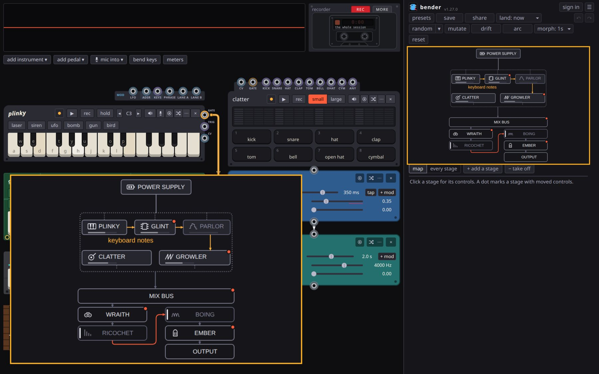
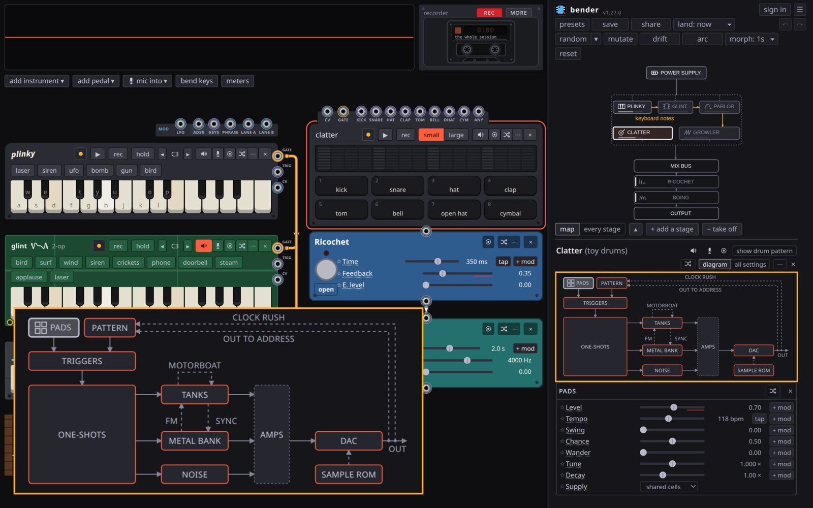
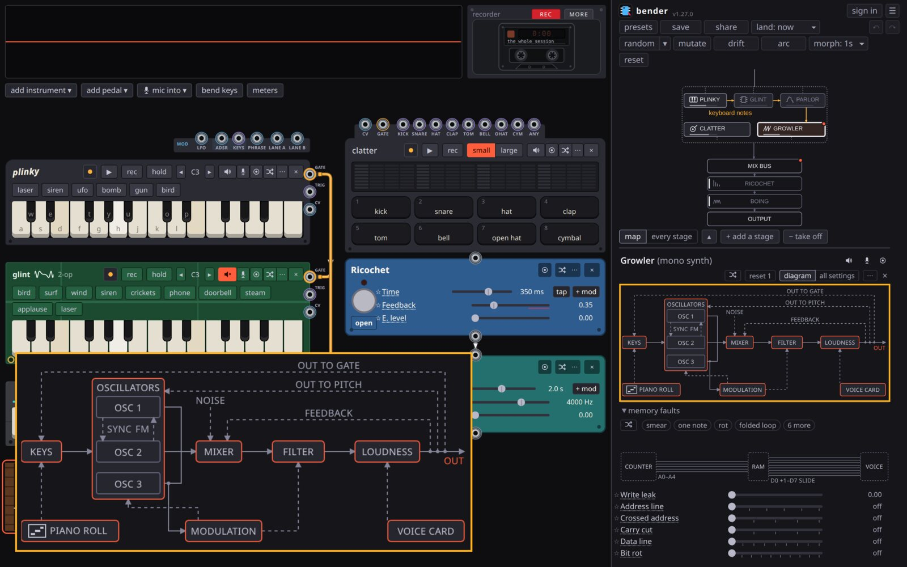
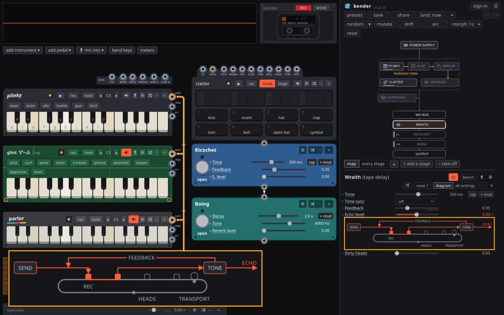
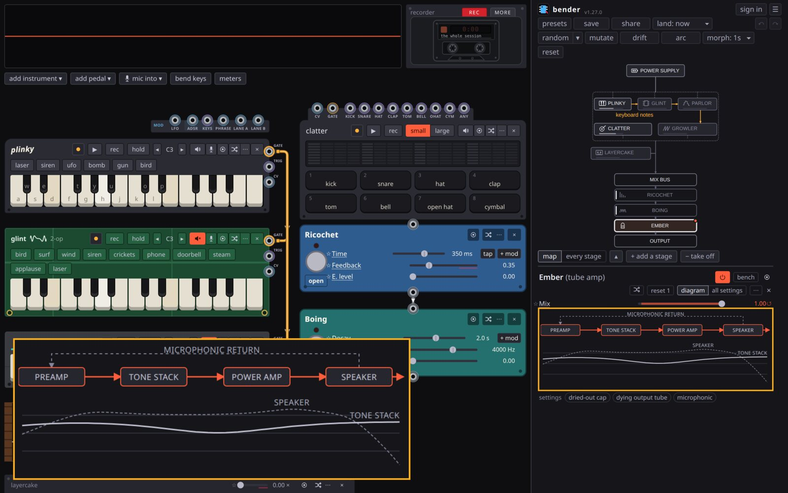
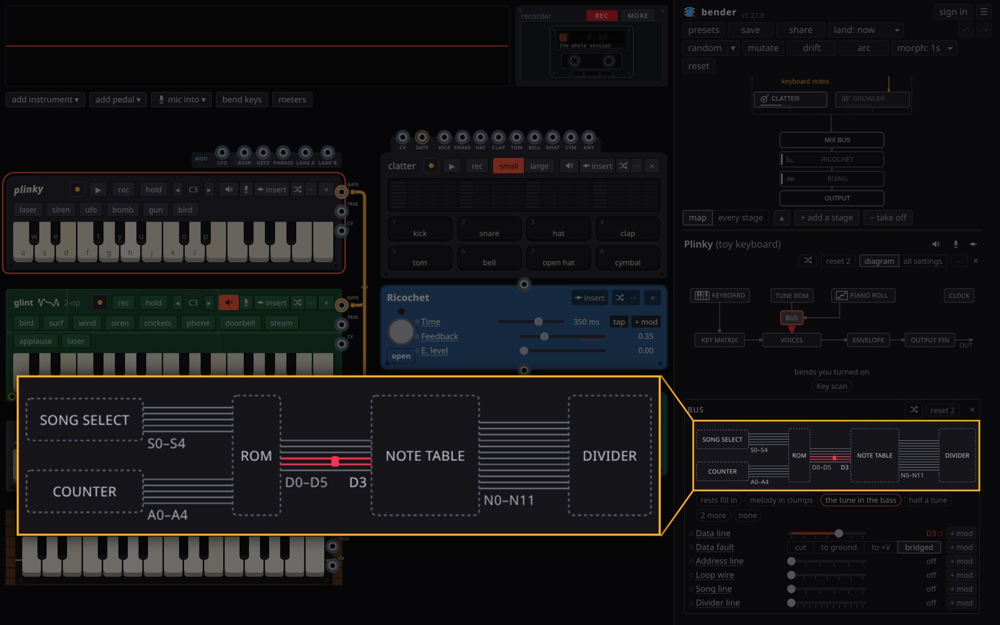
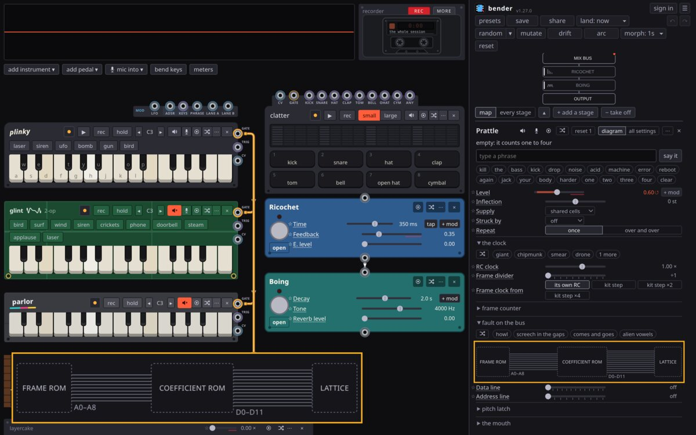

# bender

A circuit bender in the browser, built on Web Audio's
[AudioWorklet](https://developer.mozilla.org/en-US/docs/Web/API/AudioWorklet).


- [App](https://cmdcolin.github.io/bender/app/)
- [Pocket](https://cmdcolin.github.io/bender/pocket/), for phones
- [Home](https://cmdcolin.github.io/bender/), with your saved voices
- [Blog](https://cmdcolin.github.io/bender/blog/)
- [Jam of the day](https://cmdcolin.github.io/bender/jam/)

Watch Claude Code play it:
[Letting an AI agent drive bender](https://cmdcolin.github.io/bender/blog/agent-drives-the-app/)

## Machines

- **Plinky** — a toy keyboard
- **Clatter** — a drum machine
- **Glint** — an FM synth
- **Parlor** — a sampling keyboard
- **Prattle** — a speech chip that says what you type
- **Growler** — a bass synth
- **Howler** — a lead synth

## Other sources

- **Sheet** — a steel sheet you hit
- **Bottle** — a glass bottle you tap
- **Chaos osc** — an oscillator that runs wild on its own
- **Mic** — your microphone

## Pedals

- **Gnash** — distortion
- **Wraith** — tape echo
- **Ricochet** — delay
- **Boing** — spring reverb
- **Chorale** — chorus
- **Ember** — tube amp

Also **Ring mod**, **Crusher**, **Comb**, **Octave**, **Codec** and others.

## Tape and samples

- **Spool** — a tape loop you can record onto
- **Layercake** — a cassette four-track
- Samples — any audio file, or old records and radio from archive.org

## Playing

- Sequencer — a piano roll and drum steps
- Patch bay — wire modulation onto the controls
- MIDI — plug in a controller
- Share — a link holds the whole board
- Presets — boards to start from
- Agent — Claude Code plays it
  ([blog post](https://cmdcolin.github.io/bender/blog/agent-drives-the-app/))

## Gallery

Each picture opens its board in the app.

### Signal path

<a href="https://cmdcolin.github.io/bender/app/#p=UHhdZPoBeKYByAE&v=3"></a>

Every sound runs through one signal path, drawn at the top right. Click a box on
it to open that part.

### Instruments

<table>
<tr><td><a href="https://cmdcolin.github.io/bender/app/"></a><br><b>Clatter</b> — the drum voices</td></tr>
<tr><td><a href="https://cmdcolin.github.io/bender/app/#p=qQN4&v=3"></a><br><b>Growler</b> — the voice card</td></tr>
</table>

### Pedals

<table>
<tr><td><a href="https://cmdcolin.github.io/bender/app/#p=rgFk&v=3"></a><br><b>Wraith</b> — the tape loop and heads</td></tr>
<tr><td><a href="https://cmdcolin.github.io/bender/app/#p=0ATIAQ&v=3"></a><br><b>Ember</b> — the amp and its tone curves</td></tr>
</table>

### Chips

<table>
<tr><td><a href="https://cmdcolin.github.io/bender/app/"></a><br><b>Plinky</b> — the tune ROM's bus</td></tr>
<tr><td><a href="https://cmdcolin.github.io/bender/app/#p=vQh4&v=3"></a><br><b>Prattle</b> — the speech ROMs</td></tr>
</table>

## Run

```sh
pnpm install
pnpm dev
```

Then open http://localhost:4321/bender/app/.

## Docs

- [User guide](docs/USER-GUIDE.md)
- [Features](docs/features.md) — every control
- [Bends](docs/BENDS.md)
- [How it works](docs/HOW-IT-WORKS.md)
- [MIDI](docs/MIDI.md)
- [AI usage](docs/AI-USAGE.md)
- [Development](docs/DEVELOPMENT.md)

## Credits

Started from a Claude Fable template and extensively vibecoded. See also
[videoskillet.com](https://videoskillet.com).
