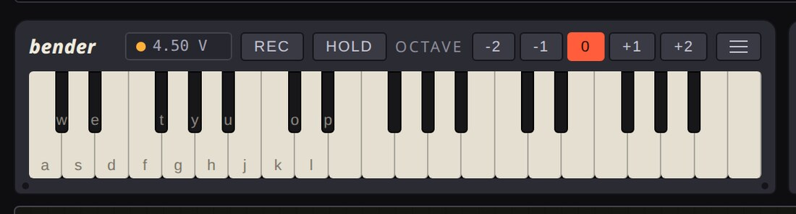
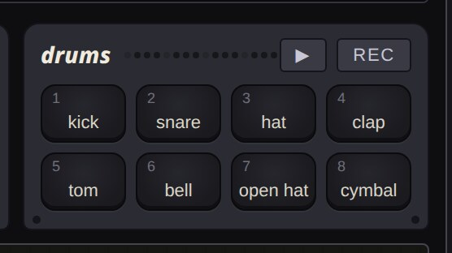
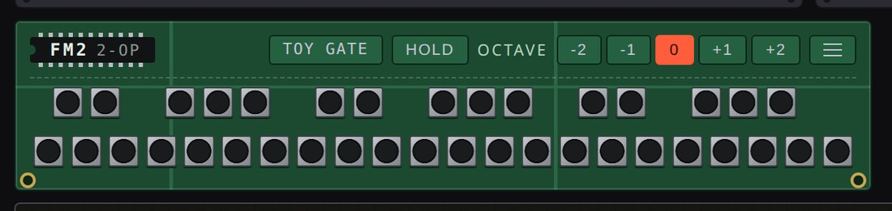
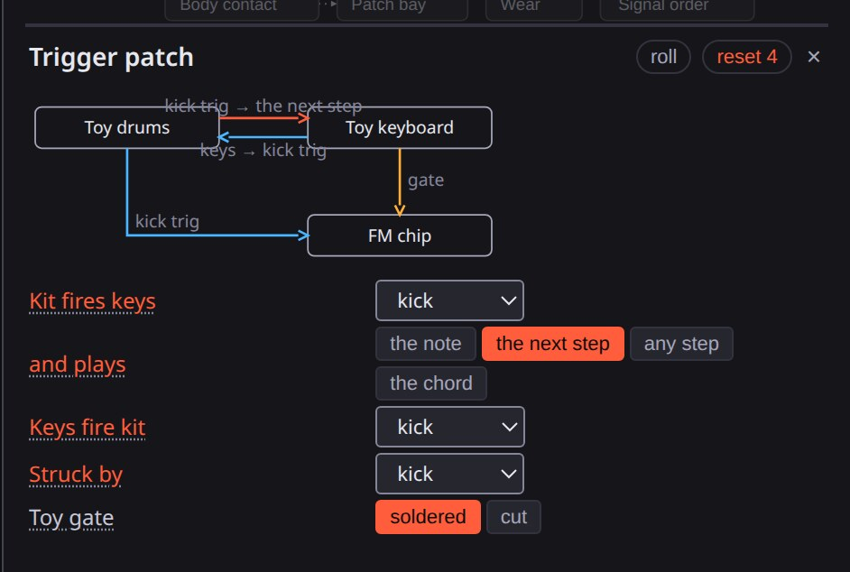
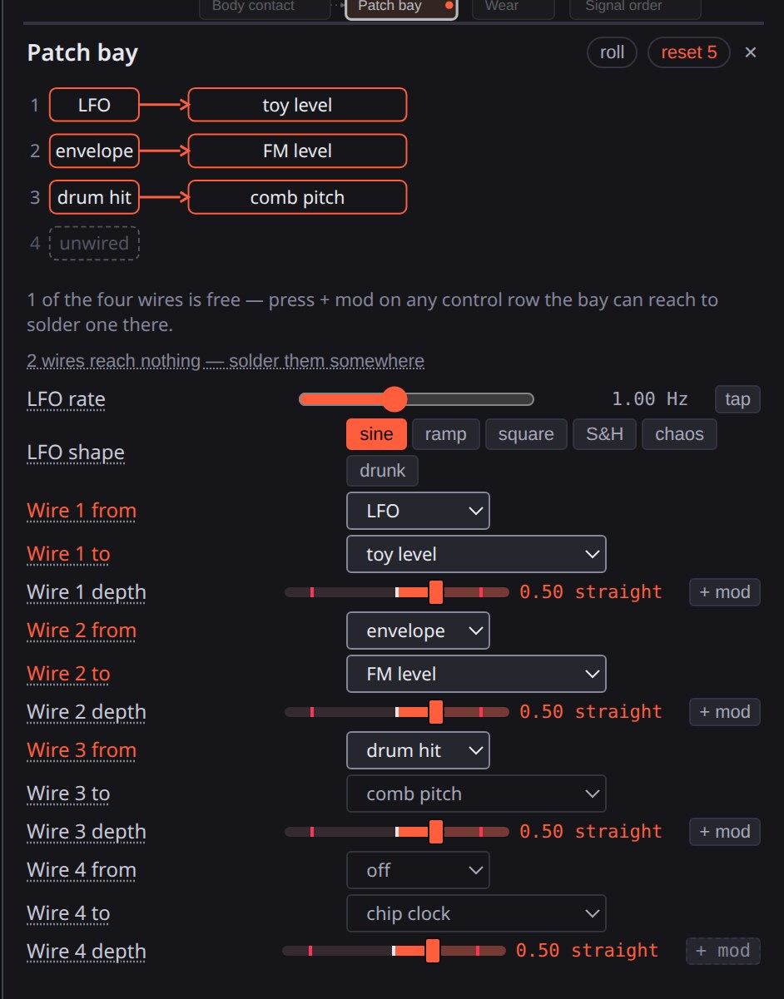
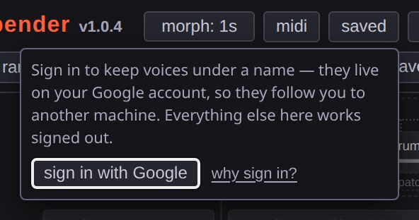

# User guide

How to play bender, once the board is in front of you.

## Playing the keyboard



The on-screen board draws three octaves starting at C3, fewer on a narrow
window or phone. `z`/`x` shift the whole board two octaves either way. The
sixteen keys under your typing hand carry their letter, printed the way the
toy printed note names on its own keys.

**Hold** latches every key you touch until you press it again. Alt-click pins
down a single key on its own, for a drone under both hands. A key that loses
its release — the window loses focus, a controller unplugs mid-press —
releases itself, so the note doesn't ring forever.

Keys light for whatever is actually playing them: your hand in the accent
colour, the toy playing itself (the ROM tune, the auto bass-chord, the trigger
patch) in amber. A note fades from the light as it fades from the mix, and a
note cut short by a brownout goes dark early. A note played past either end of
the drawn board marks that end instead.

**Tone** taps the divider chain at 1/2, 1/4, 1/8 or 1/16 pulse width. The
narrower taps thin the sound by nulling different harmonics, uncorrected, same
as the original chips. Near the top of the keyboard's range a counter can't
strike a pulse that narrow, so the narrow settings widen back toward a plain
square.

## The melody memory

**Rec** on the deck, or **record** on the piano roll, arms recording — even
with the chip silent. Every key you press after that, on-screen, on the letter
keys, or from a controller, writes to the step the chip is standing on.

What you record isn't a separate sequencer: it's the 19th entry on **Tune**,
one past the 18 ROM songs, and the chip treats it the same as any of them —
**Memory rate** sets its speed, the auto bass-chord plays under it, the clock
bend and a brownout affect it the same way, and **Struck by** can clock it
from the drum machine instead of the crystal.

The **piano roll** draws that memory: one row per pitch, one column per step.
Click a cell to place a note, drag to draw a run, click again to remove it,
shift-click to hold the previous step's note. A held note draws as one bar
across its steps. Two octaves show at a time, with arrows to move the window.
The memory is 32 steps and keeps its own length, so a four-step phrase loops
eight times against a sixteen-step drum pattern.

A step is one of 64 codes: 62 pitches (a little over five octaves) plus rest
and hold. The octave switch can move the keyboard further than those codes
reach; a note at the far end wraps to the nearest octave that fits. The
accompaniment takes the melody's lowest note as its tonic and checks for a
flat third to pick major or minor.

The memory is undo-tracked like the drum pattern — random rolls, mutate and
morph never touch it, it rides in the shared link, and every note or hold you
play is its own step in the undo history.

## Auto bass-chord

Auto bass-chord is the accompaniment section: bass on the beat, a chord stab
on the offbeat, the bass alternating root and fifth. It runs off the melody's
own step clock, reads its chord from the tune currently playing, and runs on
the same divider and rail as everything else — starving the chip or dragging
its clock takes the backing band down with the tune.

## The arpeggiator

**Arpeggio** takes the keys you're holding and plays them one at a time:
**up**, **down**, **up-down**, **random**, or **as played** (the order your
fingers went down). Hold a chord, or throw the **hold** switch and let go —
latched keys arpeggiate the same as held ones.

**Arp rate** is notes a second; **Arp range** is how many octaves the figure
climbs before repeating. Neither is its own clock — the arpeggiator runs off
the chip's divider, so **Clock**, a pot on the timing pin and a flat rail all
drag the figure with the tune. **Kit sync** does not reach it.

The figure goes out on the gate line like any other note, so it plays the FM
chip too wherever that jumper is soldered on, and **Keys fire kit** turns it
into a drum pattern.

## Kit sync

**Kit sync** brings the drum machine's step clock to the toy's timing chain,
so the tune counts off the kit's tempo instead of its own crystal. Pick how
much of a beat one step of the tune is worth: **sixteenths**, **eighths**, or
**quarters**. It reaches the melody, both memory lanes, and the auto
bass-chord — not the arpeggiator, which keeps its own rate knob.

It replaces the rate the song was written at, nothing else: **Clock**, a pot
on the timing pin, **Crystal drift** and a flat rail still move a locked toy
the same as a free one. It's a wire on the timing pin, not a phase detector —
both machines hang off the one divider, so a sag lands on both sides at once.

Off is the crystal, and off is the default. **lock**, beside **Clock**, is the
older way to the same place: it sets the crystal to the nearest speed at which
this song's steps divide into the kit's, once, then holds nothing.

## The key lock

**Key lock** closes a key off the scale onto the one under it. Pick a scale
(**major**, **minor**, **dorian**, **mixolydian**, either **pentatonic**,
**blues**, **whole tone**) and a **Key**, and everything played into the board
comes out in that key: both keybeds, a MIDI controller, the arpeggiator, and
the trigger patch's **any step**. It moves a note by a semitone or two, never
an octave.

It sits on the key line: the demo songs and your melody memory always play in
whatever key they were written in. Off is the default.

## The drum machine

The kit is a sixteen-step grid. Eight voices — **kick**, **snare**, **hat**,
**clap**, **tom**, **cowbell**, **open hat**, **cymbal** — each get a row of
steps, with an accent row underneath. Ten factory patterns sit as buttons
above the grid, each an editable starting point.

**Tempo** carries a **tap** button: press it in time and the kit takes the
speed off your hand. The same button sits on both delay times and the patch
bay's oscillator.

**Swing** holds every offbeat step back and gives the next step less time.
**Tune** and **Decay** move the whole kit; **Ring** is the one to reach for
after those — the kick, tom and snare body are resonant networks, and winding
Ring past nine tenths latches them into notes that ring until you wind it
back. See [Bends](BENDS.md) for what **Ring**, **Trigger pulse**, **Snappy**,
**Accent sag**, **Bit depth**, **Ladder**, **Voice slot** and **Overflow** do
to the kit's cheap-DAC quirks. **Voice slot** ties the kit together: one
converter serves eight voices, so a step that stacks the kit comes out
coarser than the same voice alone.

Four voices are one part: the cowbell, both hats and the cymbal come off a
single bank of six square oscillators. **Bank spread** widens the bank,
detuning the cowbell and roughening the hats together. **Metal** blends
between that bank and the noise transistor the hat used to be made of;
**Cymbal tone** slides the cymbal between a crash and a splash. The two hats
share a cap — writing a hat step under a ringing open hat cuts it short, the
way a foot does — and **Choke** moves that resistor to any pair of voices.

Press a step and drag across the grid to draw a run. Each row has its own
length: shift-click a step to loop the row back from there, with a badge
showing where it ends (press the badge to give it all sixteen back). A
five-step hat against a sixteen-step kick is polymeter — the two line up
again only every eighty steps.

Click a step past lit and it wires through the kit's dice instead: drawn as a
ring with a dot, it fires as often as **Chance** says. A third click turns it
off. Chance at zero silences those steps; Chance at max makes them ordinary.
An accent is a weight on whatever step already fires, so the accent row
carries no dice.

**Roll**, **Vary**, **Turnaround**, **Shift**, and **Half**/**Double** rewrite
the grid without touching tempo or tone: a new pattern, a couple of small
changes, a fill over the end of the bar, every row moved one step later
(shift-click to move back), and the bar stretched or compressed.



A row's name is also a preview button. The kit plays on the number row too:
`1` is the kick through `8` the cymbal. The toy drum machine's rubber pads do
the same, with lamps that follow the step counter and its own **▶**/**rec**
switches. **Record** arms the kit to write from what you play — needs the kit
running to land on a step.

## Playing the FM chip

The FM chip has no sequencer of its own; its key input is wired onto the toy
keyboard's gate line, so it plays whatever the toy strikes. **Struck by** can
wire a kit voice onto that line too.



Bring the chip up in the mix and a second keybed appears, drawn as a green
circuit board, wired to this chip only, with its own hold and octave
switches. **toy gate** is how the board ships; pressing it to **gate cut**
leaves the chip answering only its own keys and the kit's trigger lines. One
computer keyboard plays whichever bed has **computer keyboard plays this
bed** ticked, and a MIDI controller plays the toy's keybed unless you split it
— see [MIDI](MIDI.md).

**Voice** picks one of eight patches, **Brightness** sets how much modulator
reaches the carrier, **Feedback** sets how much modulator feeds back into
itself. A key held under your hand stays on for as long as you hold it;
anything else that triggers the chip — the demo song, a drum hit, a trigger
line — sends only an edge, so **Note length** decides when it stops. Four
voices (e.piano, bell, bass, marimba) decay on their own regardless of key
state; the other four wait for release.

**Level**, **Brightness** and **Feedback** run past the chip's normal range —
a red tick marks it, and the readout turns red past it. Level goes to ×4; past
1 on Brightness and past 7 on Feedback a booster takes over from the
register, multiplying modulation and feedback further. **Drive** pushes the
four voices into the output stage, up to 36 dB, squaring notes into fuzz.

**Vibrato** switches on the die's one LFO — no rate or depth register, just
two bits wiring the operators to a wobble that's been running since the board
came up. **tremolo** takes about a decibel off the level, **vibrato** moves
pitch about seven cents, **both** does both. Tremolo reads quieter than
expected because a modulator moving up and down moves brightness the opposite
way from the carrier's level — wind **Brightness** down and it's obvious.

**Rhythm** re-taps the top two channels onto a ROM kit instead of the
keyboard: a bass drum, and a snare and hi-hat fed by the chip's one noise
source, a shift register. It costs two of the four voices, the same two an
effect wants. **Noise blob** solders that shift register onto the sine table
with the rhythm bank switched over — a touch is dirt on the note, wound
across it gates the carrier by the register instead.

**Mod ratio**, **Car ratio** and **Mod decay** shape the patch further; see
[Bends](BENDS.md) for what a fault actually does at the register level. The
patch bay reaches every knob that matters, knife included: **FM cut depth**,
**FM noise blob**, **FM bright** — and **FM bright** is worth trying first,
since the processor only re-sends a patch when a knob moves, so a wire there
writes the register every block instead of four times a note.

## The talking pet

The talking pet is a furry toy wired onto the keyboard's batteries. Raise
**Level** and it says hello. What it says depends on its mood:

- **asleep** — snores now and then; any sound or kit hit wakes it.
- **awake** — greets you and chats; twenty seconds of quiet makes it sleepy, a
  long stretch awake makes it hungry.
- **chatty** — after a kit hit; laughs and sings.
- **hungry** — asks for food until the next kit hit.
- **scared** — after a loud sound or a burst of hits.
- **sleepy** — yawns, then sleeps; a low supply keeps it here.

It hears the mic and the board's own output, ignoring the output while it
talks. **Chatter** sets how often it talks unprompted and how long it stays
awake in quiet. **Pitch** moves the voice alone; **Clock** moves pitch,
formants and speed together. **Motor** is the eye-and-ear motor, which loads
the shared supply when it turns. The knife, **Frame hold** and **K bits** are
in [Bends](BENDS.md).

While **Level** is above zero the pet appears under the toy keyboard and drum
machine. Its ears swing and eyelids close while the motor turns, its beak
opens with speech, a bubble shows the phrase, and a caption names its mood.
Clicking it tickles it: a sleeping pet wakes, an awake one gets chatty, a
quick run of clicks scares it.

## The trigger patch

The keyboard and drum machine share a power rail by accident; the trigger
patch is what you wire between them on purpose.



**Kit fires keys** bridges a drum hit onto the keyboard's gate: the note
played is its own setting — the one already standing, the next step of the
ROM tune, a random step, or a tone from the current chord. **Next step** is
the one to try first, since it clocks the whole board, bass and chord stabs
included, off one drum hit.

**Keys fire kit** is the wire back: every note the chip plays also fires a
drum voice, pattern running or not. **The step** option hands it to the grid
instead, so a key fires whatever column the sequencer sits on.

Bridge both directions and the two machines play each other — a rattle at the
audio block rate, held in check by the safety tail.

Two more wires land on the FM chip, the only way anything reaches it. **Toy
gate** is the factory jumper off the keyboard's gate line; cut it and the
chip stops following the keyboard. **Struck by** clips the kit's trigger
lines onto the same input, one voice per pentatonic step, turning a drum
pattern into a riff. Every wire here, and the shared rail, can also be bent —
see [Bends](BENDS.md).

## Presets and rolls

Click a preset to load the whole board. Drag it sideways and it morphs only
part of the way there, under your finger; drag back and it retraces. Random
rolls, **mutate**, and **drift** never touch the demo song, the pattern, or
the output/mic/sample levels.

A roll moves only a handful of controls, and any control that counts in beats (delay time, glitch slice, drum retrigger) lands on a
division of the beat. A control with red ticks has a normal range — rolls,
**mutate** and **drift** stay inside it unless you've already set it past.
**Wreck it**, **slam** and **on the edge** use the whole track.

Every stage's panel has its own **roll** and **reset**; the signal path map's
control count, pressed, does the same reset without opening the panel.

Whole-board rolls sit above the presets: **rewire** shuffles the bend order
without retuning, **one bend** clears the slots to one and rolls it hard,
**wreck it** pushes feedback, supply and bit depth all at once (the safety
tail holds it), **slam** drives one to three controls to an extreme, **on the
edge** drives two opposing controls to opposite extremes, **let it age**
turns all five ageing controls up together, **patch** solders two or three
wires from a moving source onto a stage that's actually running, and
**cascade** solders one wire onto another wire's own depth.



Every control a wire can land on carries a **+ mod** button beside its
readout: the press solders the first spare LFO wire onto that control and
folds the wire out under the row, tagged with what's driving it and how fast
(`∿ LFO 1.0Hz`). Press the chip to fold it back, **× unplug** to remove it —
the next **+ mod** restores the same patch. It's an ordinary bay wire
throughout, saved and shared like the rest.

**Hunt** tries six boards, plays each a second and a half, and keeps
whichever rides closest to the limiter without burying it. None of the
candidates it passed through land in the undo history — the whole hunt is a
single step.

**Drift** is mutate on a timer: roughly every fifteen seconds the board sets
off toward a new nearby setting, so the sound never cuts and never quite
arrives. One `ctrl+z` restores the board from before it started.

**Share** copies the current board into the page's URL.

## Demo songs

The ROM bank holds 18 tunes: four factory demos, eight public-domain pieces
(Für Elise, Ode to Joy, Rondo alla Turca, William Tell, and others), and six
slower ones in minor and modal keys. Once you've played something into the
melody memory, it's the 19th entry on the same selector.

## Playback and recording

**play demo song** and **play drums** are independent run switches. `space`
toggles both at once and restores whatever was actually running before.

**Record wav** captures the actual audio output as a 16-bit stereo wav file —
different from the keyboard's **Rec** and the drum machine's **Record**,
which capture what you played rather than what comes out of the speakers.

### Stems

The selector beside it sets what a take comes back as. **Master only** is one
file. **Master + stems** adds one wav per source that had anything on it —
toy keyboard, drums, FM chip, chaos oscillator, noise, sampler, pet — named
`bender-<stamp>-toy.wav`, `-drums`, `-fm`, `-chaos`, `-noise`, `-sampler`,
`-pet`, beside `bender-<stamp>-master.wav`.

A stem is the dry source, taken where it sums into the mix bus — before the
bus drive, bends, pedals, brownout, tape and limiter, all of which apply only
to the sum. Stems won't add up to the master in a DAW; the master is the
instrument, the stems are what went into it. The mic and the feedback return
aren't stems — the mic lands on the bus, the return feeds the desk back into
itself — both are in the master only.

Stems are mono: five of the six sources put the same sample on both channels,
and noise takes the middle of its two streams. A stem take stops at two
minutes (a master take gets ten) — seven tracks of 48 kHz float run about 1.5
MB per second held in the tab. There's no zip, so stopping a stem take fires
up to seven downloads at once; your browser may ask permission for multiple
files.

## The link is the board

The address bar carries the whole board — every control off stock, the drum
pattern, the melody — in the `#`, with no server involved. It comes out short
by default:

```
https://cmdcolin.github.io/bender/app/#p=AJYBL1p-AgDABwCQAQDoBwF4
```

The long form spells the same board out, and the app reads and writes both:

```
https://cmdcolin.github.io/bender/app/#set=chipLevel:0.75,drumLevel:0.45,echoMode:1,echoMs:480,echoFb:0.72,echoToneHz:5000,echoLevel:0.6
```

The long form is four times the characters, which is why the bar carries the
short one, but it's what lets you program a board by hand: a control name
from [features.md](features.md), a colon, a number, commas between.

```
#set=chipStarve:0.8,dlyFb:0.6,drumKick:33825
```

Anything left out is stock, anything out of range is pulled back, and an
unknown name is dropped. A bar already carrying `#set=` keeps carrying it;
type a bare `#set=` to switch a tab over. Every preset link in
[features.md](features.md) is written this way.

## Signing in and saved voices

A voice is a whole board under a name. Three things save one, all saving the
same thing: **save** in the panel's row of verbs, **ctrl+S** (**⌘S** on a
Mac), and the **saved** popover's name box.

A press saves under the name the popover is already showing — the preset the
board is standing on, or the voice you last saved or recalled. A name already
in the list overwrites that voice in place.



Pressing save with nobody signed in opens **why sign in?**. Sign in from
there and the board you were looking at saves under the name you gave it; a
name your account already holds gets a number appended (_dying toy 2_).

Each row in the list: press the name to **recall** it (shift+click to
overwrite it with the current board); **↗** opens it whole and at once; **⧉**
copies a link to it, playable signed out; **×** deletes it.

The list lives on your Google account, so a voice named on the laptop is
there on the phone, and clearing site data doesn't lose it. **sign in**
becomes your account photo once you're in; press it to sign out. Nothing else
in bender needs an account — presets, rolls, MIDI, recording and every link
work signed out. The
[privacy page](https://cmdcolin.github.io/bender/privacy/) lists what the
account holds.

Signed in, the app also mirrors the board you have open onto your account;
the [home page](https://cmdcolin.github.io/bender/) offers it back under
**Continue where you left off**. A recording on the sampler and the mic don't
travel with it. Opening the app, a demo, or a shared link doesn't touch the
mirror until you change something.

The home page lists your voices, newest first. **Copy link**, **Rename**
(refuses a name another voice already has), and **Delete** (asks once) sit
under each card.
