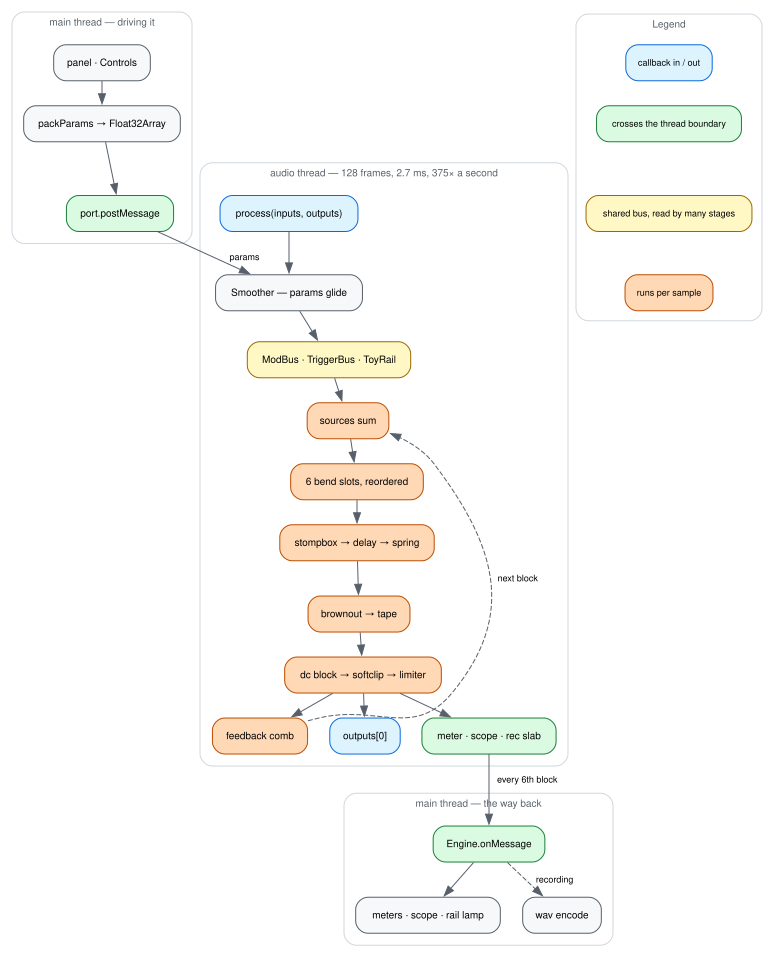

# How a block gets rendered



[dataflow.dot](img/dataflow.dot) is the source. GitHub does not render DOT, so
the SVG is committed; re-render it in the same commit as any edit:

```sh
dot -Tsvg docs/img/dataflow.dot -o docs/img/dataflow.svg
```

Nothing checks that. Graphviz is not a dependency and different versions emit
different bytes, so a staleness check would fail on toolchain drift rather than
on a stale diagram.

**This is not the signal path.** The drawing at the top of the
[README](../README.md#the-signal-path) is, it is generated from the same code
the panel draws with, and it shows which stage feeds which. This one shows how a
block gets rendered at all: which thread each step runs on, where the two of
them talk, and which steps run per sample rather than per block. Those are the
facts [optimizations.md](optimizations.md) keeps referring to, and the signal
path cannot show any of them.

The panel owns a `Controls` object. `packParams` flattens it to a `Float32Array`
and posts it across; the worklet keeps the newest one as a target and glides
toward it a block at a time, so a knob dragged at frame rate never steps the
audio. Every block then builds its buses, sums the sources, runs the bend slots
in whatever order the board is wired in, then the pedals, the post stages and
the safety tail — and hands one 128-frame buffer back. Every sixth block a meter
message goes the other way, which is what the panel's scope, meters and rail
lamp draw from.

Apart from the params, the diagram is the main path only. The mic arrives as an
input to the same callback and is mixed into `ctx.mic`; the sampler's audio, the
keyboard's note on and off, the transport's run switches, panic and record all
come through the same port as the params and are handled in the same
`onmessage`; MIDI is a main-thread concern that ends up as those same messages.

## Where the buses sit

The yellow node is three of them, and they are what make this instrument argue
with itself rather than merely process audio.

**`ToyRail`** is one supply shared by the toy keyboard and the toy drums. Both
draw on it, its voltage sets their pitch and their amplitude, and when it droops
past the watchdog they both reboot. That is a bus rather than a parameter: no
stage owns it, and two stages pulling on it is the point.

**`ModBus`** is the patch bay: a wire runs from a source to a destination, and
the lanes are resolved once a block, one per destination. Stages ask for their
lane and get `null` when nothing is wired there, so an unpatched board runs the
code it always ran. A wire can also land on another wire's depth, so the lanes
are built depth-first.

**`TriggerBus`** carries the two boxes' trigger lines, so the kit can fire the
keyboard and the keyboard can fire the kit. It swaps at the top of the block:
what a stage reads is last block's hits, which is 2.7 ms old and under the
resolution a trigger line has ever had.

Alongside them `Ctx` carries the per-sample buses every stage can read — the
rail voltage, supply sag and droop, the output envelope, the chip's sequencer
phase, and `bright`, a signed measure of how much high-frequency energy is going
round the loop. Droop is slow and never negative, so on its own it can only make
every stage pump in step; `bright` is the fast one that can disagree with it.

## Where the thread boundary sits

Two green nodes, and everything about them is shaped by the fact that the audio
thread cannot afford to wait or to allocate.

Going in, the whole param set is posted as one packed `Float32Array` rather than
as individual messages. Going out, the meter message carries the peak, a 512-
sample scope trace, the drum tick, the limiter's duck, the rail voltage and the
reboot count — every sixth block, because everything downstream draws off a
frame callback and posting faster buys nothing.

Both directions post buffers the sender owns and reuses. That is safe because
`postMessage` serializes synchronously on the thread that calls it: by the time
it returns, the receiver's copy exists and the buffer can be written over. It is
also the reason the copy is _not_ free for the audio thread — see
[optimizations.md](optimizations.md#nothing-allocates-on-the-audio-thread),
where the same fact corrects a comment that used to claim otherwise.

Recording takes the same route. The worklet fills a slab of about 0.7 s and
posts it; the main thread owns the growing take and encodes the wav.

## What runs per sample

Everything orange, which is where the budget goes and which is why
[optimizations.md](optimizations.md) is mostly about arithmetic and memory
layout rather than about algorithms.

The split is worth stating plainly, because most of the wins in this repo came
from moving something across it. A knob holds still for the length of a block,
so anything derived only from knobs belongs at the top of the loop — filter
coefficients, a decay turned into a feedback gain, a delay time split into whole
and fractional samples. What genuinely has to run per sample is the signal
itself: every stage's inner loop, the mod lanes that move within a block, and
the safety tail's dc block, soft clip and limiter, which run on every sample the
instrument ever emits.

The feedback comb is the reason the tail is not simply the end. It taps
post-clip, delays by up to half a second and returns to the top of the next
block, which is where mixer squeal lives — the block-rate global loop alone is
too slow for it. The dashed edge is the only place a block depends on the one
before it.
