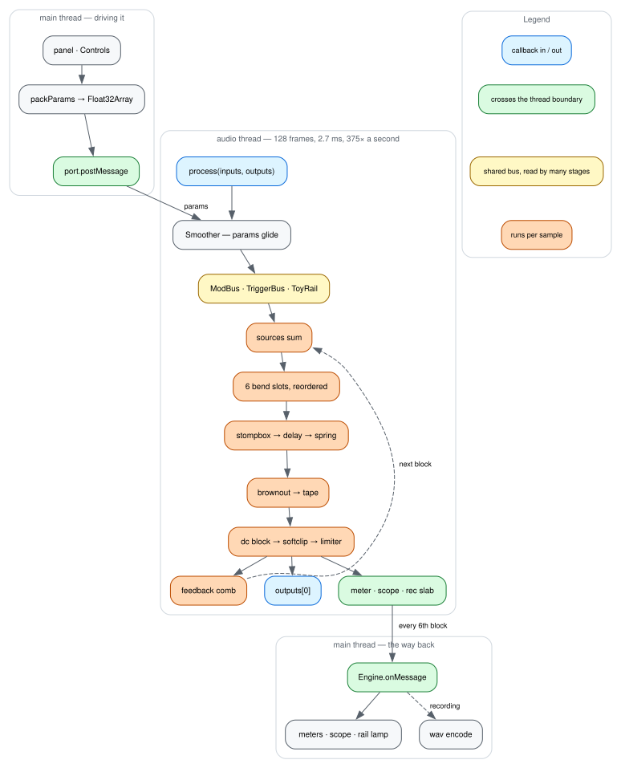

# How a block gets rendered

[dataflow.dot](img/dataflow.dot) is the source;
[DEVELOPMENT.md](DEVELOPMENT.md#generated-docs-and-audit-sweeps) gives the
command that re-renders it.

The [signal path map](HOW-IT-WORKS.md#the-signal-path-map) shows which stage
feeds which. This diagram shows which thread each step runs on, where the
threads exchange messages, and which steps run per sample rather than per block.
[optimizations.md](optimizations.md) refers to those facts throughout.

The panel owns a `Controls` object. `packParams` flattens it to a `Float32Array`
and posts it across; the worklet keeps the newest one as a target and glides
toward it a block at a time, so a knob dragged at frame rate produces no steps
in the audio. Every block then builds its buses, sums the sources, runs each
machine with a unit patched onto it through its insert line and then each set of
lines with a unit on it, all before the summing amp, then runs the bend slots in
whatever order the board is wired in, the pedals, the post stages and the safety
tail — and hands one 128-frame buffer back. Every sixth block the worklet posts
a meter message the other way, and the panel draws its scope, meters and rail
lamp from it.

Apart from the params, the diagram is the main path only. The mic arrives as an
input to the same callback and is mixed into `ctx.mic`; the sampler's audio, the
keyboard's note on and off, the transport's run switches, panic and record all
come through the same port as the params and are handled in the same
`onmessage`. The main thread handles MIDI and sends the worklet those same
messages.

## Effects on sets of lines

Each bend and pedal has a Lines control: 0 for master, or a mask of the lines it
runs on, with the mic at bit 0 and source k at bit 1 + k. The chain turns the
mask into tap bits through a table and keeps tap numbering from there on.

- A unit on one line runs inside that machine's insert line.
- Units with the same mask of two or more lines form a bundle and run one after
  another in rack order: the sockets as the relay walks them, the loose bends,
  then the pedals.
- Bundles run after every insert line, ordered by how many lines they hold, so a
  mask inside another runs first; ties go by rack order.
- A bundle's input is the sum of its lines plus the returns of the earlier
  bundles whose masks are subsets of its own. It adds its output minus its input
  to the bus, since a pedal mixes its wet signal into the dry.
- When two masks overlap and neither holds the other, the two bundles run side
  by side on the dry lines.
- A unit whose new mask shares a line with the old one keeps running and
  crossfades its input over one block. A move to a disjoint mask, or to or from
  master, fades out, flushes the unit and fades in on the new lines.
- The carrier, logic, toy and FM side buses carry a line after its one-line
  units. Units on master pass through the solder joints, and no other unit does.
- Wraith on a bundle still takes the kit's echo row through `ctx.send`, and its
  Send knob trims the bundle's sum.

## Where the buses sit

The yellow node holds three buses that connect stages outside the signal path.

**`ToyRail`** is one supply shared by the toy keyboard and the toy drums. Both
draw on it, its voltage sets their pitch and their amplitude, and when it droops
past the watchdog they both reboot. Two stages draw on it and neither owns it,
so it is a bus and not a parameter.

**`ModBus`** is the patch bay: a wire runs from a source to a destination, and
the lanes are resolved once a block, one per destination. Stages ask for their
lane and get `null` when nothing is wired there, so an unpatched board runs the
code it always ran. A wire can also target another wire's depth, so the lanes
are built depth-first.

**`TriggerBus`** holds the two boxes' trigger lines, so the kit can fire the
keyboard and the keyboard can fire the kit. It swaps at the top of each block,
so a stage reads the previous block's hits, which are 2.7 ms old and under the
resolution a trigger line has ever had.

Alongside them `Ctx` holds the per-sample buses every stage can read — the rail
voltage, supply sag and droop, the output envelope, the chip's sequencer phase,
and `bright`, a signed measure of how much high-frequency energy is going round
the loop. Droop is slow and never negative, so stages driven by droop alone all
pump in step; `bright` is fast and signed, so it can move opposite to droop.

## Where the thread boundary sits

The audio thread cannot afford to wait or to allocate, and both green nodes
follow from that.

Going in, the whole param set is posted as one packed `Float32Array` rather than
as individual messages. Going out, the meter message contains the peak, a
512-sample scope trace, the drum tick, the limiter's duck, the rail voltage and
the reboot count, every sixth block, because everything downstream draws off a
frame callback and posting faster gains nothing.

The main thread and the worklet each post buffers they own and reuse.
[optimizations.md](optimizations.md#allocation-on-the-audio-thread) explains why
reuse is safe and what the copy costs the posting thread.

Recording uses the same port: the worklet fills a slab of about 0.7 s and posts
it; the main thread converts the slab to 16-bit and appends it to a wav file in
the origin-private file system (`engine/takeSink.ts`), so a take costs the tab
one slab at a time.

## What runs per sample

Everything orange runs per sample, and the time budget goes there, so
[optimizations.md](optimizations.md) covers arithmetic and memory layout.

Most of the speedups in this repo came from moving work from the per-sample side
to the block side, as
[optimizations.md](optimizations.md#block-rate-against-sample-rate) describes.
Per-sample work is the signal itself: every stage's inner loop, the mod lanes
that move within a block, and the safety tail's dc block, soft clip and limiter,
which run on every sample the instrument emits.

The feedback comb taps post-clip, delays by up to half a second and returns to
the top of the next block, so the tail feeds back into the chain. Mixer squeal
comes from this loop, and the block-rate global loop alone is too slow for it.
The dashed edge and `TriggerBus` are the two places a block depends on the one
before it.
